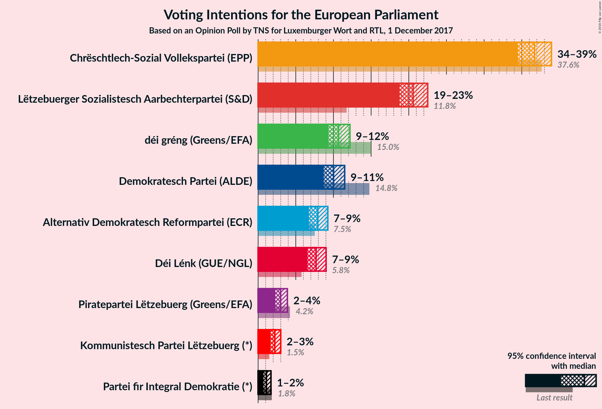
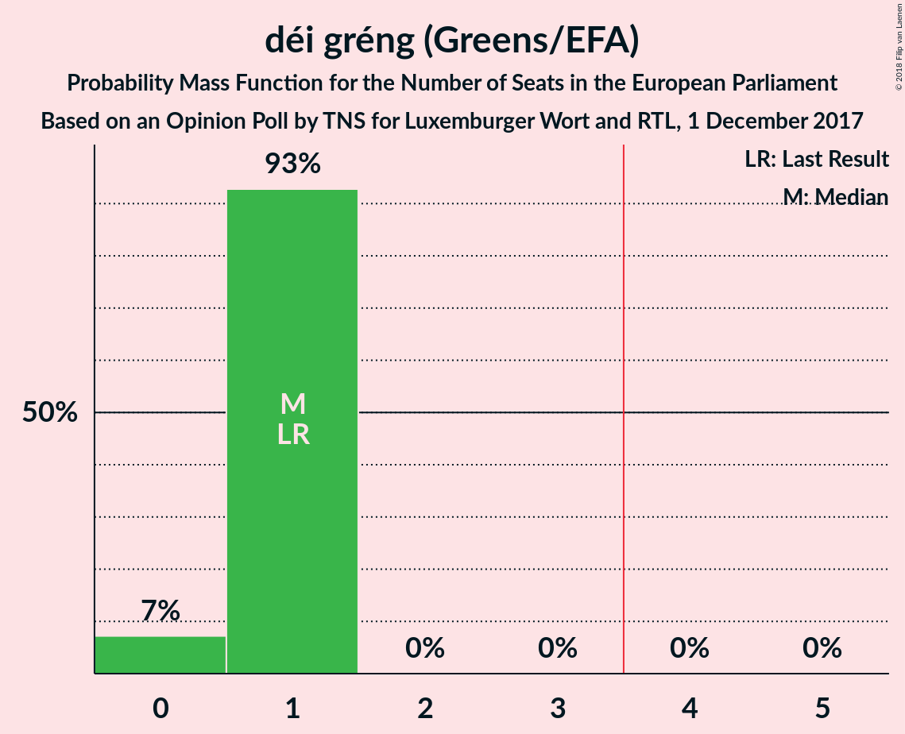
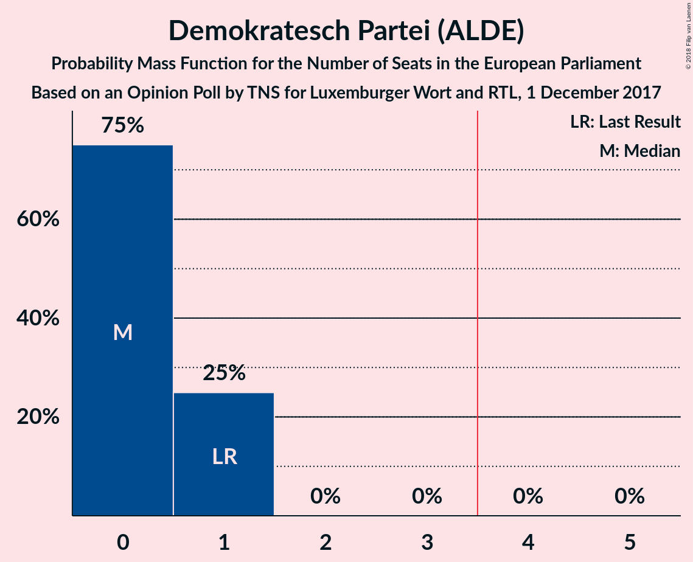
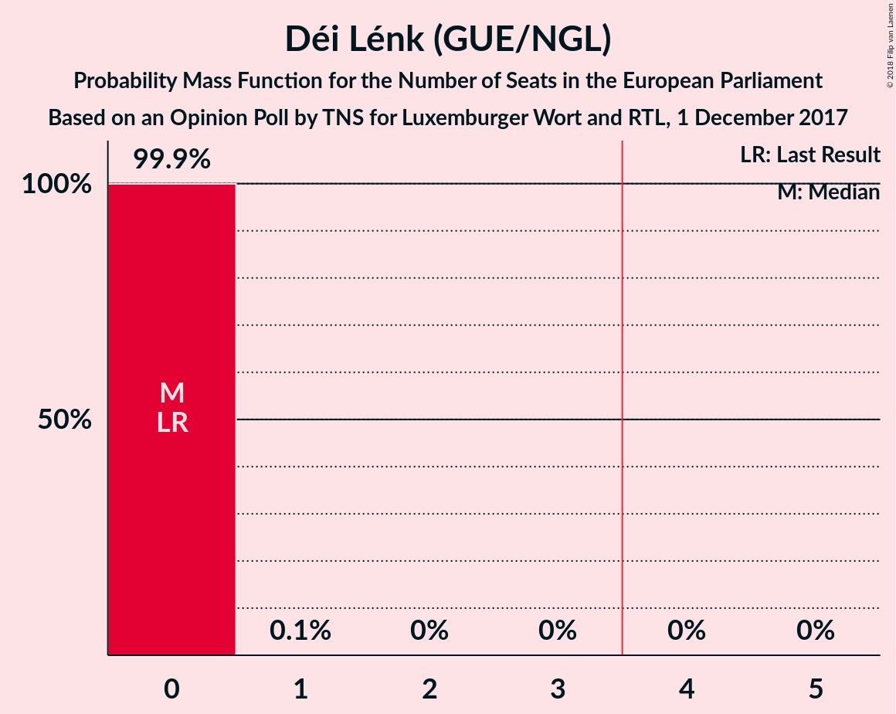
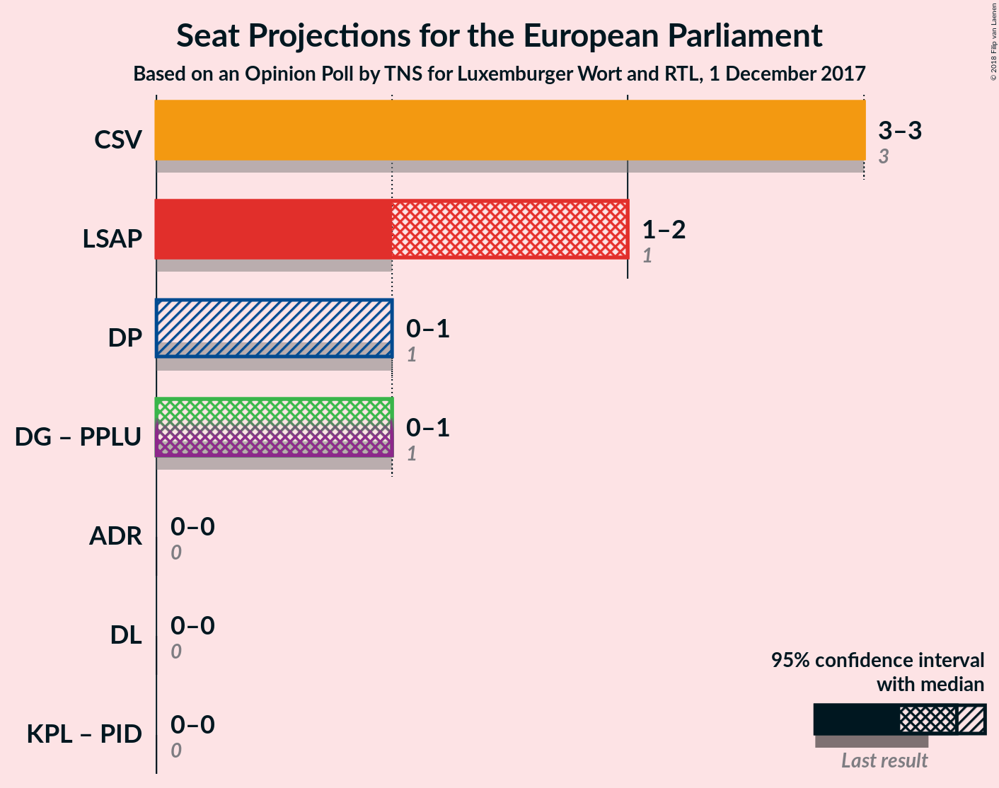

# Opinion Poll by TNS for Luxemburger Wort and RTL, 1 December 2017

<a href="#voting-intentions">Voting Intentions</a> | <a href="#seats">Seats</a> | <a href="#coalitions">Coalitions</a> | <a href="#technical-information">Technical Information</a>

## Voting Intentions

### Confidence Intervals

| Party | Last Result | Poll Result | 80% Confidence Interval | 90% Confidence Interval | 95% Confidence Interval | 99% Confidence Interval |
|:-----:|:-----------:|:-----------:|:-----------------------:|:-----------------------:|:-----------------------:|:-----------------------:|
| Chrëschtlech-Sozial Vollekspartei (EPP) | 37.6% | 36.7% | 35.3–38.2% |34.8–38.6% |34.5–38.9% |33.8–39.7% |
| Lëtzebuerger Sozialistesch Aarbechterpartei (S&D) | 11.8% | 20.6% | 19.4–21.9% |19.1–22.2% |18.8–22.5% |18.2–23.1% |
| déi gréng (Greens/EFA) | 15.0% | 10.7% | 9.8–11.7% |9.5–11.9% |9.3–12.2% |8.9–12.7% |
| Demokratesch Partei (ALDE) | 14.8% | 10.0% | 9.2–11.0% |8.9–11.2% |8.7–11.5% |8.3–12.0% |
| Alternativ Demokratesch Reformpartei (ECR) | 7.5% | 7.9% | 7.1–8.8% |6.9–9.0% |6.8–9.3% |6.4–9.7% |
| Déi Lénk (GUE/NGL) | 5.8% | 7.7% | 6.9–8.6% |6.7–8.8% |6.6–9.0% |6.2–9.4% |
| Piratepartei Lëtzebuerg (Greens/EFA) | 4.2% | 3.0% | 2.5–3.6% |2.4–3.7% |2.3–3.9% |2.1–4.2% |
| Kommunistesch Partei Lëtzebuerg (*) | 1.5% | 2.2% | 1.8–2.7% |1.7–2.9% |1.6–3.0% |1.5–3.3% |
| Partei fir Integral Demokratie (*) | 1.8% | 1.1% | 0.8–1.5% |0.8–1.6% |0.7–1.7% |0.6–1.9% |

*Note:* The poll result column reflects the actual value used in the calculations. Published results may vary slightly, and in addition be rounded to fewer digits.

## Seats

### Confidence Intervals

| Party | Last Result | Median | 80% Confidence Interval | 90% Confidence Interval | 95% Confidence Interval | 99% Confidence Interval |
|:-----:|:-----------:|:------:|:-----------------------:|:-----------------------:|:-----------------------:|:-----------------------:|
| <a href="#chrëschtlech-sozial-vollekspartei-(epp)">Chrëschtlech-Sozial Vollekspartei (EPP)</a> | 3 | 3 | 3 |3 |3 |3–4 |
| <a href="#lëtzebuerger-sozialistesch-aarbechterpartei-(s&d)">Lëtzebuerger Sozialistesch Aarbechterpartei (S&D)</a> | 1 | 2 | 1–2 |1–2 |1–2 |1–2 |
| <a href="#déi-gréng-(greens/efa)">déi gréng (Greens/EFA)</a> | 1 | 1 | 1 |0–1 |0–1 |0–1 |
| <a href="#demokratesch-partei-(alde)">Demokratesch Partei (ALDE)</a> | 1 | 0 | 0–1 |0–1 |0–1 |0–1 |
| <a href="#alternativ-demokratesch-reformpartei-(ecr)">Alternativ Demokratesch Reformpartei (ECR)</a> | 0 | 0 | 0 |0 |0 |0 |
| <a href="#déi-lénk-(gue/ngl)">Déi Lénk (GUE/NGL)</a> | 0 | 0 | 0 |0 |0 |0 |
| <a href="#piratepartei-lëtzebuerg-(greens/efa)">Piratepartei Lëtzebuerg (Greens/EFA)</a> | 0 | 0 | 0 |0 |0 |0 |
| <a href="#kommunistesch-partei-lëtzebuerg-(*)">Kommunistesch Partei Lëtzebuerg (*)</a> | 0 | 0 | 0 |0 |0 |0 |
| <a href="#partei-fir-integral-demokratie-(*)">Partei fir Integral Demokratie (*)</a> | 0 | 0 | 0 |0 |0 |0 |

### Chrëschtlech-Sozial Vollekspartei (EPP)

*For a full overview of the results for this party, see the [Chrëschtlech-Sozial Vollekspartei (EPP)](party-chrëschtlech-sozialvolleksparteiepp.html) page.*

| Number of Seats | Probability | Accumulated | Special Marks |
|:---------------:|:-----------:|:-----------:|:-------------:|
| 3 | 99.3% | 100% | Last Result, Median |
| 4 | 0.7% | 0.7% | Majority |
| 5 | 0% | 0% |  |

### Lëtzebuerger Sozialistesch Aarbechterpartei (S&D)

*For a full overview of the results for this party, see the [Lëtzebuerger Sozialistesch Aarbechterpartei (S&D)](party-lëtzebuergersozialisteschaarbechterparteisd.html) page.*

| Number of Seats | Probability | Accumulated | Special Marks |
|:---------------:|:-----------:|:-----------:|:-------------:|
| 1 | 20% | 100% | Last Result |
| 2 | 80% | 80% | Median |
| 3 | 0% | 0% |  |

### déi gréng (Greens/EFA)

*For a full overview of the results for this party, see the [déi gréng (Greens/EFA)](party-déigrénggreensefa.html) page.*

| Number of Seats | Probability | Accumulated | Special Marks |
|:---------------:|:-----------:|:-----------:|:-------------:|
| 0 | 7% | 100% |  |
| 1 | 93% | 93% | Last Result, Median |
| 2 | 0% | 0% |  |

### Demokratesch Partei (ALDE)

*For a full overview of the results for this party, see the [Demokratesch Partei (ALDE)](party-demokrateschparteialde.html) page.*

| Number of Seats | Probability | Accumulated | Special Marks |
|:---------------:|:-----------:|:-----------:|:-------------:|
| 0 | 74% | 100% | Median |
| 1 | 26% | 26% | Last Result |
| 2 | 0% | 0% |  |

### Alternativ Demokratesch Reformpartei (ECR)

*For a full overview of the results for this party, see the [Alternativ Demokratesch Reformpartei (ECR)](party-alternativdemokrateschreformparteiecr.html) page.*

| Number of Seats | Probability | Accumulated | Special Marks |
|:---------------:|:-----------:|:-----------:|:-------------:|
| 0 | 99.9% | 100% | Last Result, Median |
| 1 | 0.1% | 0.1% |  |
| 2 | 0% | 0% |  |

### Déi Lénk (GUE/NGL)

*For a full overview of the results for this party, see the [Déi Lénk (GUE/NGL)](party-déilénkguengl.html) page.*

| Number of Seats | Probability | Accumulated | Special Marks |
|:---------------:|:-----------:|:-----------:|:-------------:|
| 0 | 99.9% | 100% | Last Result, Median |
| 1 | 0.1% | 0.1% |  |
| 2 | 0% | 0% |  |

### Piratepartei Lëtzebuerg (Greens/EFA)

*For a full overview of the results for this party, see the [Piratepartei Lëtzebuerg (Greens/EFA)](party-pirateparteilëtzebuerggreensefa.html) page.*

| Number of Seats | Probability | Accumulated | Special Marks |
|:---------------:|:-----------:|:-----------:|:-------------:|
| 0 | 100% | 100% | Last Result, Median |

### Kommunistesch Partei Lëtzebuerg (*)

*For a full overview of the results for this party, see the [Kommunistesch Partei Lëtzebuerg (*)](party-kommunisteschparteilëtzebuerg.html) page.*

| Number of Seats | Probability | Accumulated | Special Marks |
|:---------------:|:-----------:|:-----------:|:-------------:|
| 0 | 100% | 100% | Last Result, Median |

### Partei fir Integral Demokratie (*)

*For a full overview of the results for this party, see the [Partei fir Integral Demokratie (*)](party-parteifirintegraldemokratie.html) page.*

| Number of Seats | Probability | Accumulated | Special Marks |
|:---------------:|:-----------:|:-----------:|:-------------:|
| 0 | 100% | 100% | Last Result, Median |

## Coalitions

### Confidence Intervals

| Coalition | Last Result | Median | Majority? | 80% Confidence Interval | 90% Confidence Interval | 95% Confidence Interval | 99% Confidence Interval |
|:---------:|:-----------:|:------:|:---------:|:-----------------------:|:-----------------------:|:-----------------------:|:-----------------------:|
| Chrëschtlech-Sozial Vollekspartei (EPP) | 3 | 3 | 0.7% | 3 | 3 | 3 | 3–4 |
| Lëtzebuerger Sozialistesch Aarbechterpartei (S&D) | 1 | 2 | 0% | 1–2 | 1–2 | 1–2 | 1–2 |
| Demokratesch Partei (ALDE) | 1 | 0 | 0% | 0–1 | 0–1 | 0–1 | 0–1 |
| déi gréng (Greens/EFA) – Piratepartei Lëtzebuerg (Greens/EFA) | 1 | 1 | 0% | 1 | 0–1 | 0–1 | 0–1 |
| Alternativ Demokratesch Reformpartei (ECR) | 0 | 0 | 0% | 0 | 0 | 0 | 0 |
| Déi Lénk (GUE/NGL) | 0 | 0 | 0% | 0 | 0 | 0 | 0 |
| Kommunistesch Partei Lëtzebuerg (*) – Partei fir Integral Demokratie (*) | 0 | 0 | 0% | 0 | 0 | 0 | 0 |

### Chrëschtlech-Sozial Vollekspartei (EPP)

| Number of Seats | Probability | Accumulated | Special Marks |
|:---------------:|:-----------:|:-----------:|:-------------:|
| 3 | 99.3% | 100% | Last Result, Median |
| 4 | 0.7% | 0.7% | Majority |
| 5 | 0% | 0% |  |

### Lëtzebuerger Sozialistesch Aarbechterpartei (S&D)

| Number of Seats | Probability | Accumulated | Special Marks |
|:---------------:|:-----------:|:-----------:|:-------------:|
| 1 | 20% | 100% | Last Result |
| 2 | 80% | 80% | Median |
| 3 | 0% | 0% |  |

### Demokratesch Partei (ALDE)

| Number of Seats | Probability | Accumulated | Special Marks |
|:---------------:|:-----------:|:-----------:|:-------------:|
| 0 | 74% | 100% | Median |
| 1 | 26% | 26% | Last Result |
| 2 | 0% | 0% |  |

### déi gréng (Greens/EFA) – Piratepartei Lëtzebuerg (Greens/EFA)

| Number of Seats | Probability | Accumulated | Special Marks |
|:---------------:|:-----------:|:-----------:|:-------------:|
| 0 | 7% | 100% |  |
| 1 | 93% | 93% | Last Result, Median |
| 2 | 0% | 0% |  |

### Alternativ Demokratesch Reformpartei (ECR)

| Number of Seats | Probability | Accumulated | Special Marks |
|:---------------:|:-----------:|:-----------:|:-------------:|
| 0 | 99.9% | 100% | Last Result, Median |
| 1 | 0.1% | 0.1% |  |
| 2 | 0% | 0% |  |

### Déi Lénk (GUE/NGL)

| Number of Seats | Probability | Accumulated | Special Marks |
|:---------------:|:-----------:|:-----------:|:-------------:|
| 0 | 99.9% | 100% | Last Result, Median |
| 1 | 0.1% | 0.1% |  |
| 2 | 0% | 0% |  |

### Kommunistesch Partei Lëtzebuerg (*) – Partei fir Integral Demokratie (*)

| Number of Seats | Probability | Accumulated | Special Marks |
|:---------------:|:-----------:|:-----------:|:-------------:|
| 0 | 100% | 100% | Last Result, Median |

## Technical Information

### Opinion Poll

+ **Polling firm:** TNS
+ **Commissioner(s):** Luxemburger Wort and RTL
+ **Fieldwork period:** 1 December 2017

### Calculations

+ **Sample size:** 1807
+ **Simulations done:** 524,288
+ **Error estimate:** 0.67%

