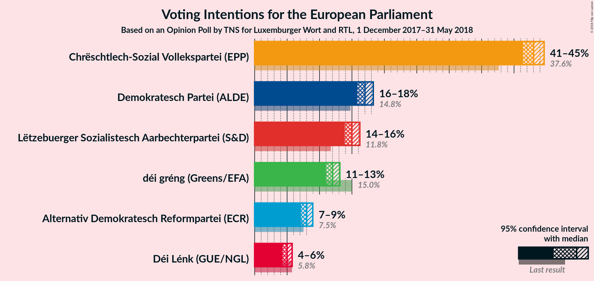
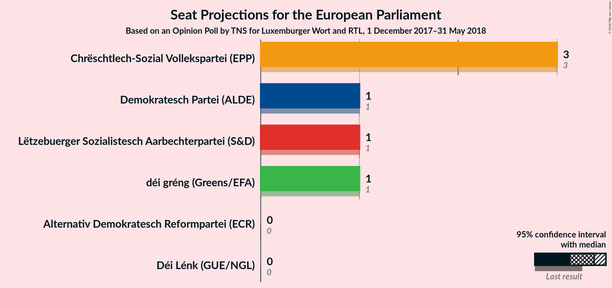
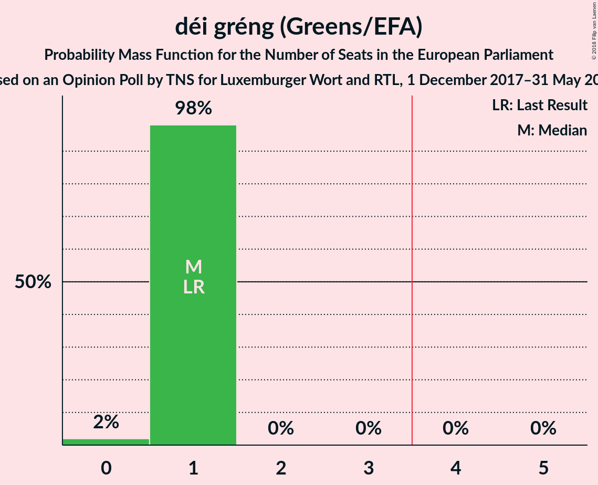
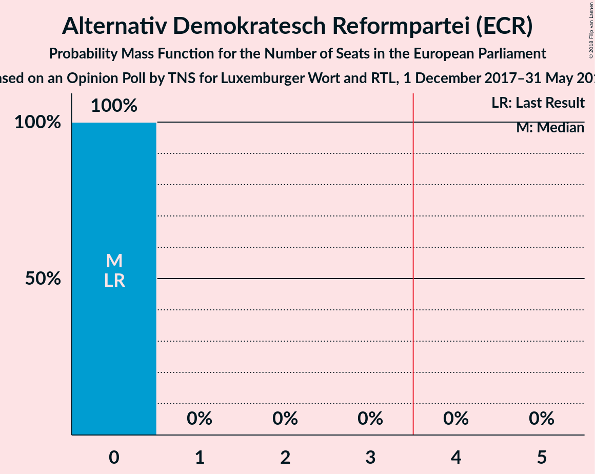
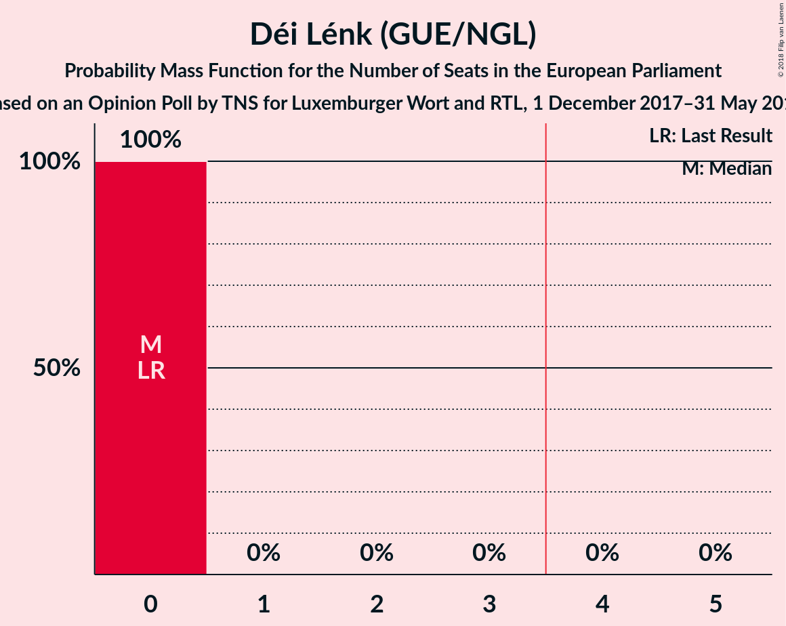
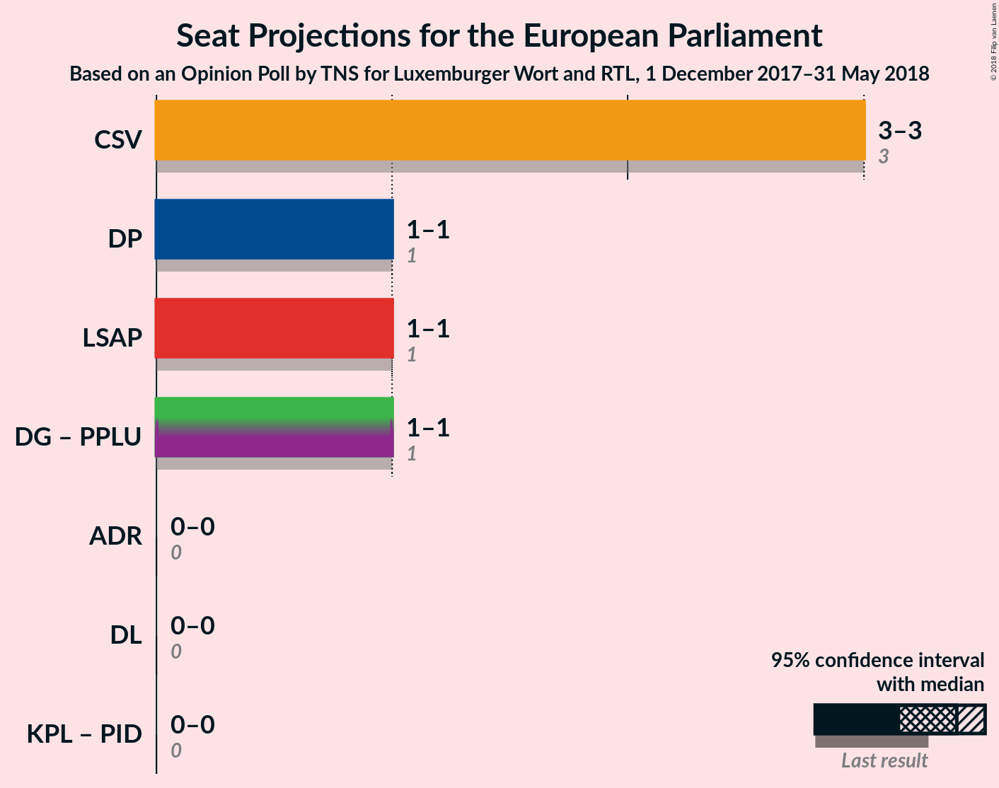

# Opinion Poll by TNS for Luxemburger Wort and RTL, 1 December 2017–31 May 2018

<a href="#voting-intentions">Voting Intentions</a> | <a href="#seats">Seats</a> | <a href="#coalitions">Coalitions</a> | <a href="#technical-information">Technical Information</a>

## Voting Intentions

### Confidence Intervals

| Party | Last Result | Poll Result | 80% Confidence Interval | 90% Confidence Interval | 95% Confidence Interval | 99% Confidence Interval |
|:-----:|:-----------:|:-----------:|:-----------------------:|:-----------------------:|:-----------------------:|:-----------------------:|
| Chrëschtlech-Sozial Vollekspartei (EPP) | 37.6% | 43.0% | 41.9–44.1% |41.6–44.4% |41.4–44.6% |40.9–45.2% |
| Demokratesch Partei (ALDE) | 14.8% | 17.0% | 16.2–17.8% |16.0–18.1% |15.8–18.3% |15.4–18.7% |
| Lëtzebuerger Sozialistesch Aarbechterpartei (S&D) | 11.8% | 15.0% | 14.2–15.8% |14.0–16.0% |13.9–16.2% |13.5–16.6% |
| déi gréng (Greens/EFA) | 15.0% | 12.0% | 11.3–12.7% |11.1–13.0% |11.0–13.1% |10.7–13.5% |
| Alternativ Demokratesch Reformpartei (ECR) | 7.5% | 8.0% | 7.4–8.6% |7.3–8.8% |7.1–9.0% |6.9–9.3% |
| Déi Lénk (GUE/NGL) | 5.8% | 5.0% | 4.6–5.5% |4.4–5.7% |4.3–5.8% |4.1–6.0% |

*Note:* The poll result column reflects the actual value used in the calculations. Published results may vary slightly, and in addition be rounded to fewer digits.

## Seats

### Confidence Intervals

| Party | Last Result | Median | 80% Confidence Interval | 90% Confidence Interval | 95% Confidence Interval | 99% Confidence Interval |
|:-----:|:-----------:|:------:|:-----------------------:|:-----------------------:|:-----------------------:|:-----------------------:|
| <a href="#chrëschtlech-sozial-vollekspartei-(epp)">Chrëschtlech-Sozial Vollekspartei (EPP)</a> | 3 | 3 | 3 |3 |3 |3–4 |
| <a href="#demokratesch-partei-(alde)">Demokratesch Partei (ALDE)</a> | 1 | 1 | 1 |1 |1 |1 |
| <a href="#lëtzebuerger-sozialistesch-aarbechterpartei-(s&d)">Lëtzebuerger Sozialistesch Aarbechterpartei (S&D)</a> | 1 | 1 | 1 |1 |1 |1 |
| <a href="#déi-gréng-(greens/efa)">déi gréng (Greens/EFA)</a> | 1 | 1 | 1 |1 |1 |0–1 |
| <a href="#alternativ-demokratesch-reformpartei-(ecr)">Alternativ Demokratesch Reformpartei (ECR)</a> | 0 | 0 | 0 |0 |0 |0 |
| <a href="#déi-lénk-(gue/ngl)">Déi Lénk (GUE/NGL)</a> | 0 | 0 | 0 |0 |0 |0 |

### Chrëschtlech-Sozial Vollekspartei (EPP)

*For a full overview of the results for this party, see the [Chrëschtlech-Sozial Vollekspartei (EPP)](party-chrëschtlech-sozialvolleksparteiepp.html) page.*

| Number of Seats | Probability | Accumulated | Special Marks |
|:---------------:|:-----------:|:-----------:|:-------------:|
| 3 | 98.5% | 100% | Last Result, Median |
| 4 | 1.5% | 1.5% | Majority |
| 5 | 0% | 0% |  |

### Demokratesch Partei (ALDE)

*For a full overview of the results for this party, see the [Demokratesch Partei (ALDE)](party-demokrateschparteialde.html) page.*

| Number of Seats | Probability | Accumulated | Special Marks |
|:---------------:|:-----------:|:-----------:|:-------------:|
| 1 | 100% | 100% | Last Result, Median |

### Lëtzebuerger Sozialistesch Aarbechterpartei (S&D)

*For a full overview of the results for this party, see the [Lëtzebuerger Sozialistesch Aarbechterpartei (S&D)](party-lëtzebuergersozialisteschaarbechterparteisd.html) page.*

| Number of Seats | Probability | Accumulated | Special Marks |
|:---------------:|:-----------:|:-----------:|:-------------:|
| 1 | 100% | 100% | Last Result, Median |

### déi gréng (Greens/EFA)

*For a full overview of the results for this party, see the [déi gréng (Greens/EFA)](party-déigrénggreensefa.html) page.*

| Number of Seats | Probability | Accumulated | Special Marks |
|:---------------:|:-----------:|:-----------:|:-------------:|
| 0 | 1.5% | 100% |  |
| 1 | 98.5% | 98.5% | Last Result, Median |
| 2 | 0% | 0% |  |

### Alternativ Demokratesch Reformpartei (ECR)

*For a full overview of the results for this party, see the [Alternativ Demokratesch Reformpartei (ECR)](party-alternativdemokrateschreformparteiecr.html) page.*

| Number of Seats | Probability | Accumulated | Special Marks |
|:---------------:|:-----------:|:-----------:|:-------------:|
| 0 | 100% | 100% | Last Result, Median |

### Déi Lénk (GUE/NGL)

*For a full overview of the results for this party, see the [Déi Lénk (GUE/NGL)](party-déilénkguengl.html) page.*

| Number of Seats | Probability | Accumulated | Special Marks |
|:---------------:|:-----------:|:-----------:|:-------------:|
| 0 | 100% | 100% | Last Result, Median |

## Coalitions

### Confidence Intervals

| Coalition | Last Result | Median | Majority? | 80% Confidence Interval | 90% Confidence Interval | 95% Confidence Interval | 99% Confidence Interval |
|:---------:|:-----------:|:------:|:---------:|:-----------------------:|:-----------------------:|:-----------------------:|:-----------------------:|
| Chrëschtlech-Sozial Vollekspartei (EPP) | 3 | 3 | 1.5% | 3 | 3 | 3 | 3–4 |
| Demokratesch Partei (ALDE) | 1 | 1 | 0% | 1 | 1 | 1 | 1 |
| Lëtzebuerger Sozialistesch Aarbechterpartei (S&D) | 1 | 1 | 0% | 1 | 1 | 1 | 1 |
| Alternativ Demokratesch Reformpartei (ECR) | 0 | 0 | 0% | 0 | 0 | 0 | 0 |
| Déi Lénk (GUE/NGL) | 0 | 0 | 0% | 0 | 0 | 0 | 0 |

### Chrëschtlech-Sozial Vollekspartei (EPP)

| Number of Seats | Probability | Accumulated | Special Marks |
|:---------------:|:-----------:|:-----------:|:-------------:|
| 3 | 98.5% | 100% | Last Result, Median |
| 4 | 1.5% | 1.5% | Majority |
| 5 | 0% | 0% |  |

### Demokratesch Partei (ALDE)

| Number of Seats | Probability | Accumulated | Special Marks |
|:---------------:|:-----------:|:-----------:|:-------------:|
| 1 | 100% | 100% | Last Result, Median |

### Lëtzebuerger Sozialistesch Aarbechterpartei (S&D)

| Number of Seats | Probability | Accumulated | Special Marks |
|:---------------:|:-----------:|:-----------:|:-------------:|
| 1 | 100% | 100% | Last Result, Median |

### Alternativ Demokratesch Reformpartei (ECR)

| Number of Seats | Probability | Accumulated | Special Marks |
|:---------------:|:-----------:|:-----------:|:-------------:|
| 0 | 100% | 100% | Last Result, Median |

### Déi Lénk (GUE/NGL)

| Number of Seats | Probability | Accumulated | Special Marks |
|:---------------:|:-----------:|:-----------:|:-------------:|
| 0 | 100% | 100% | Last Result, Median |

## Technical Information

### Opinion Poll

+ **Polling firm:** TNS
+ **Commissioner(s):** Luxemburger Wort and RTL
+ **Fieldwork period:** 1 December 2017–31 May 2018

### Calculations

+ **Sample size:** 3521
+ **Simulations done:** 131,072
+ **Error estimate:** 0.88%

