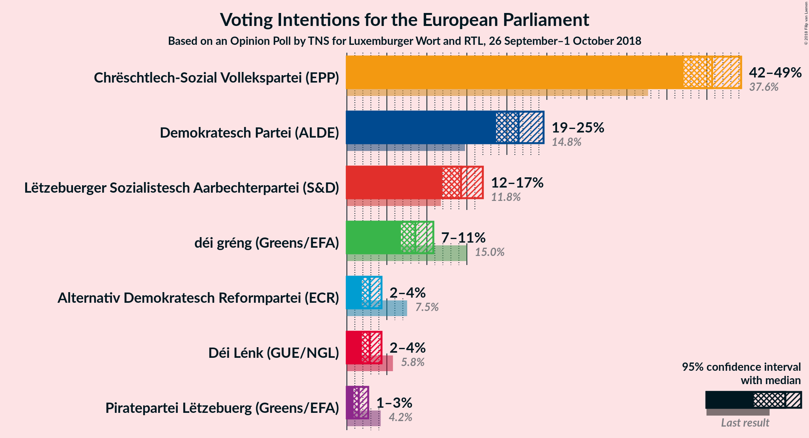
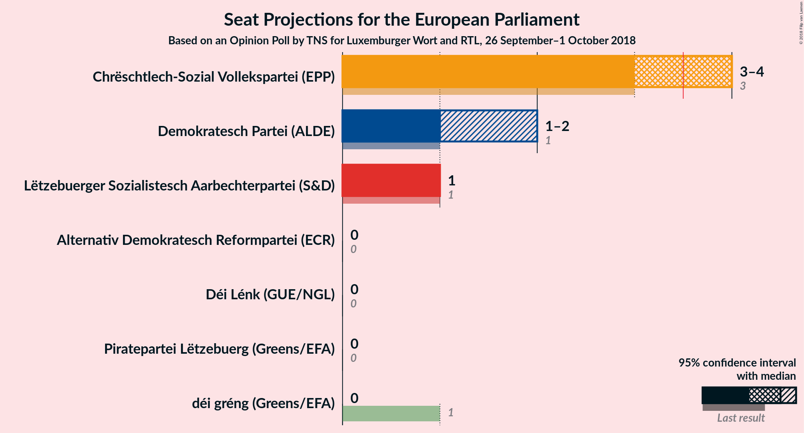
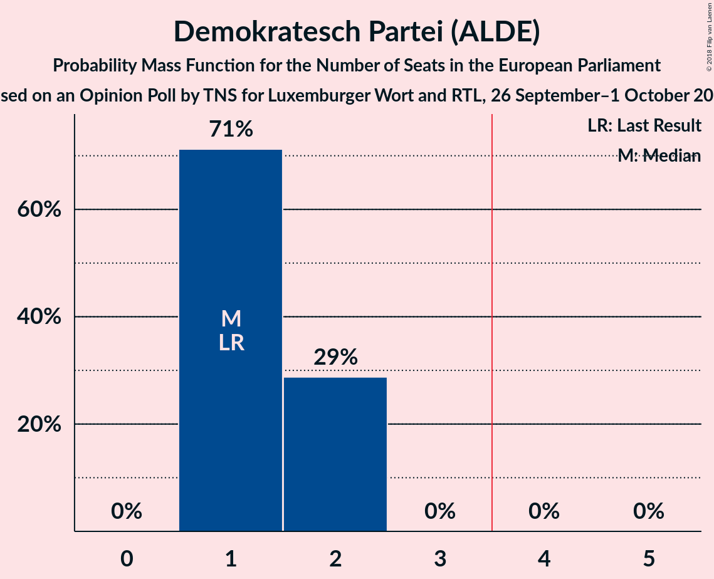
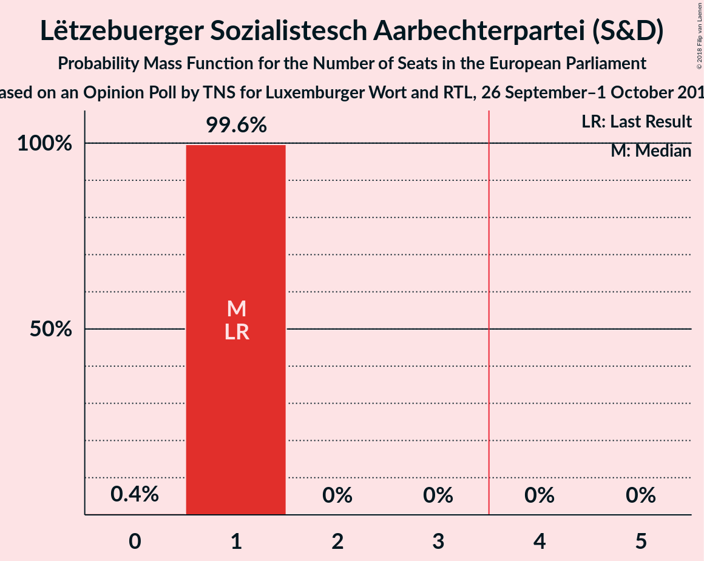
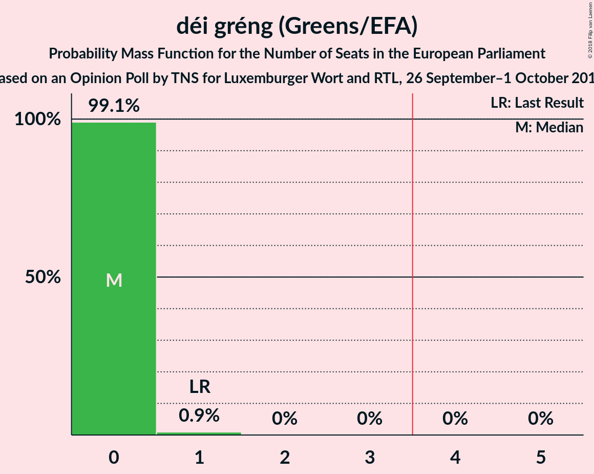
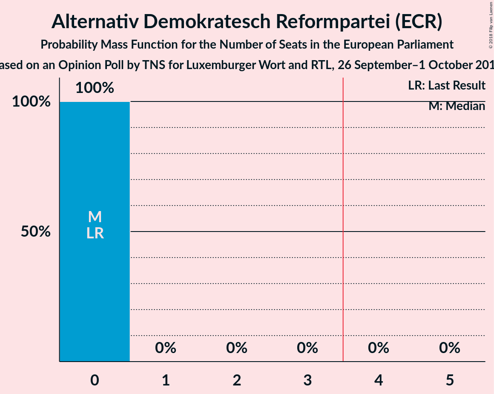
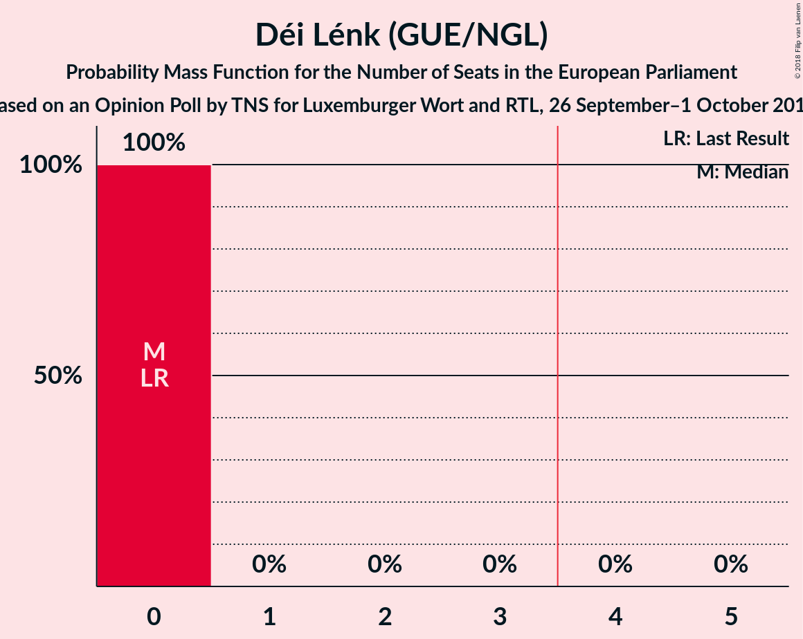
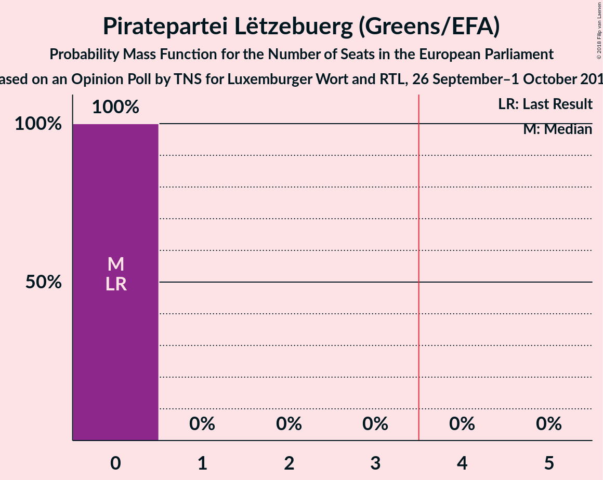

# Opinion Poll by TNS for Luxemburger Wort and RTL, 26 September–1 October 2018

<a href="#voting-intentions">Voting Intentions</a> | <a href="#seats">Seats</a> | <a href="#coalitions">Coalitions</a> | <a href="#technical-information">Technical Information</a>

## Voting Intentions

### Confidence Intervals

| Party | Last Result | Poll Result | 80% Confidence Interval | 90% Confidence Interval | 95% Confidence Interval | 99% Confidence Interval |
|:-----:|:-----------:|:-----------:|:-----------------------:|:-----------------------:|:-----------------------:|:-----------------------:|
| Chrëschtlech-Sozial Vollekspartei (EPP) | 37.6% | 45.7% | 43.3–48.0% |42.6–48.7% |42.1–49.3% |41.0–50.4% |
| Demokratesch Partei (ALDE) | 14.8% | 21.5% | 19.6–23.5% |19.1–24.1% |18.7–24.6% |17.8–25.6% |
| Lëtzebuerger Sozialistesch Aarbechterpartei (S&D) | 11.8% | 14.3% | 12.7–16.0% |12.3–16.6% |11.9–17.0% |11.2–17.9% |
| déi gréng (Greens/EFA) | 15.0% | 8.6% | 7.4–10.0% |7.0–10.4% |6.8–10.8% |6.2–11.6% |
| Alternativ Demokratesch Reformpartei (ECR) | 7.5% | 2.9% | 2.2–3.8% |2.0–4.1% |1.9–4.3% |1.6–4.8% |
| Déi Lénk (GUE/NGL) | 5.8% | 2.9% | 2.2–3.8% |2.0–4.1% |1.9–4.3% |1.6–4.8% |
| Piratepartei Lëtzebuerg (Greens/EFA) | 4.2% | 1.5% | 1.1–2.3% |0.9–2.5% |0.8–2.7% |0.7–3.1% |

*Note:* The poll result column reflects the actual value used in the calculations. Published results may vary slightly, and in addition be rounded to fewer digits.

## Seats

### Confidence Intervals

| Party | Last Result | Median | 80% Confidence Interval | 90% Confidence Interval | 95% Confidence Interval | 99% Confidence Interval |
|:-----:|:-----------:|:------:|:-----------------------:|:-----------------------:|:-----------------------:|:-----------------------:|
| <a href="#chrëschtlech-sozial-vollekspartei-(epp)">Chrëschtlech-Sozial Vollekspartei (EPP)</a> | 3 | 4 | 3–4 |3–4 |3–4 |3–4 |
| <a href="#demokratesch-partei-(alde)">Demokratesch Partei (ALDE)</a> | 1 | 1 | 1–2 |1–2 |1–2 |1–2 |
| <a href="#lëtzebuerger-sozialistesch-aarbechterpartei-(s&d)">Lëtzebuerger Sozialistesch Aarbechterpartei (S&D)</a> | 1 | 1 | 1 |1 |1 |1 |
| <a href="#déi-gréng-(greens/efa)">déi gréng (Greens/EFA)</a> | 1 | 0 | 0 |0 |0 |0–1 |
| <a href="#alternativ-demokratesch-reformpartei-(ecr)">Alternativ Demokratesch Reformpartei (ECR)</a> | 0 | 0 | 0 |0 |0 |0 |
| <a href="#déi-lénk-(gue/ngl)">Déi Lénk (GUE/NGL)</a> | 0 | 0 | 0 |0 |0 |0 |
| <a href="#piratepartei-lëtzebuerg-(greens/efa)">Piratepartei Lëtzebuerg (Greens/EFA)</a> | 0 | 0 | 0 |0 |0 |0 |

### Chrëschtlech-Sozial Vollekspartei (EPP)

*For a full overview of the results for this party, see the [Chrëschtlech-Sozial Vollekspartei (EPP)](party-chrëschtlech-sozialvolleksparteiepp.html) page.*

| Number of Seats | Probability | Accumulated | Special Marks |
|:---------------:|:-----------:|:-----------:|:-------------:|
| 3 | 29% | 100% | Last Result |
| 4 | 71% | 71% | Median, Majority |
| 5 | 0% | 0% |  |

### Demokratesch Partei (ALDE)

*For a full overview of the results for this party, see the [Demokratesch Partei (ALDE)](party-demokrateschparteialde.html) page.*

| Number of Seats | Probability | Accumulated | Special Marks |
|:---------------:|:-----------:|:-----------:|:-------------:|
| 1 | 71% | 100% | Last Result, Median |
| 2 | 29% | 29% |  |
| 3 | 0% | 0% |  |

### Lëtzebuerger Sozialistesch Aarbechterpartei (S&D)

*For a full overview of the results for this party, see the [Lëtzebuerger Sozialistesch Aarbechterpartei (S&D)](party-lëtzebuergersozialisteschaarbechterparteisd.html) page.*

| Number of Seats | Probability | Accumulated | Special Marks |
|:---------------:|:-----------:|:-----------:|:-------------:|
| 0 | 0.4% | 100% |  |
| 1 | 99.6% | 99.6% | Last Result, Median |
| 2 | 0% | 0% |  |

### déi gréng (Greens/EFA)

*For a full overview of the results for this party, see the [déi gréng (Greens/EFA)](party-déigrénggreensefa.html) page.*

| Number of Seats | Probability | Accumulated | Special Marks |
|:---------------:|:-----------:|:-----------:|:-------------:|
| 0 | 99.1% | 100% | Median |
| 1 | 0.9% | 0.9% | Last Result |
| 2 | 0% | 0% |  |

### Alternativ Demokratesch Reformpartei (ECR)

*For a full overview of the results for this party, see the [Alternativ Demokratesch Reformpartei (ECR)](party-alternativdemokrateschreformparteiecr.html) page.*

| Number of Seats | Probability | Accumulated | Special Marks |
|:---------------:|:-----------:|:-----------:|:-------------:|
| 0 | 100% | 100% | Last Result, Median |

### Déi Lénk (GUE/NGL)

*For a full overview of the results for this party, see the [Déi Lénk (GUE/NGL)](party-déilénkguengl.html) page.*

| Number of Seats | Probability | Accumulated | Special Marks |
|:---------------:|:-----------:|:-----------:|:-------------:|
| 0 | 100% | 100% | Last Result, Median |

### Piratepartei Lëtzebuerg (Greens/EFA)

*For a full overview of the results for this party, see the [Piratepartei Lëtzebuerg (Greens/EFA)](party-pirateparteilëtzebuerggreensefa.html) page.*

| Number of Seats | Probability | Accumulated | Special Marks |
|:---------------:|:-----------:|:-----------:|:-------------:|
| 0 | 100% | 100% | Last Result, Median |

## Coalitions

### Confidence Intervals

| Coalition | Last Result | Median | Majority? | 80% Confidence Interval | 90% Confidence Interval | 95% Confidence Interval | 99% Confidence Interval |
|:---------:|:-----------:|:------:|:---------:|:-----------------------:|:-----------------------:|:-----------------------:|:-----------------------:|
| Chrëschtlech-Sozial Vollekspartei (EPP) | 3 | 4 | 71% | 3–4 | 3–4 | 3–4 | 3–4 |
| Demokratesch Partei (ALDE) | 1 | 1 | 0% | 1–2 | 1–2 | 1–2 | 1–2 |
| Lëtzebuerger Sozialistesch Aarbechterpartei (S&D) | 1 | 1 | 0% | 1 | 1 | 1 | 1 |
| Alternativ Demokratesch Reformpartei (ECR) | 0 | 0 | 0% | 0 | 0 | 0 | 0 |
| Déi Lénk (GUE/NGL) | 0 | 0 | 0% | 0 | 0 | 0 | 0 |
| déi gréng (Greens/EFA) – Piratepartei Lëtzebuerg (Greens/EFA) | 1 | 0 | 0% | 0 | 0 | 0 | 0–1 |

### Chrëschtlech-Sozial Vollekspartei (EPP)

| Number of Seats | Probability | Accumulated | Special Marks |
|:---------------:|:-----------:|:-----------:|:-------------:|
| 3 | 29% | 100% | Last Result |
| 4 | 71% | 71% | Median, Majority |
| 5 | 0% | 0% |  |

### Demokratesch Partei (ALDE)

| Number of Seats | Probability | Accumulated | Special Marks |
|:---------------:|:-----------:|:-----------:|:-------------:|
| 1 | 71% | 100% | Last Result, Median |
| 2 | 29% | 29% |  |
| 3 | 0% | 0% |  |

### Lëtzebuerger Sozialistesch Aarbechterpartei (S&D)

| Number of Seats | Probability | Accumulated | Special Marks |
|:---------------:|:-----------:|:-----------:|:-------------:|
| 0 | 0.4% | 100% |  |
| 1 | 99.6% | 99.6% | Last Result, Median |
| 2 | 0% | 0% |  |

### Alternativ Demokratesch Reformpartei (ECR)

| Number of Seats | Probability | Accumulated | Special Marks |
|:---------------:|:-----------:|:-----------:|:-------------:|
| 0 | 100% | 100% | Last Result, Median |

### Déi Lénk (GUE/NGL)

| Number of Seats | Probability | Accumulated | Special Marks |
|:---------------:|:-----------:|:-----------:|:-------------:|
| 0 | 100% | 100% | Last Result, Median |

### déi gréng (Greens/EFA) – Piratepartei Lëtzebuerg (Greens/EFA)

| Number of Seats | Probability | Accumulated | Special Marks |
|:---------------:|:-----------:|:-----------:|:-------------:|
| 0 | 99.1% | 100% | Median |
| 1 | 0.9% | 0.9% | Last Result |
| 2 | 0% | 0% |  |

## Technical Information

### Opinion Poll

+ **Polling firm:** TNS
+ **Commissioner(s):** Luxemburger Wort and RTL
+ **Fieldwork period:** 26 September–1 October 2018

### Calculations

+ **Sample size:** 736
+ **Simulations done:** 131,072
+ **Error estimate:** 0.73%

