# Opinion Poll by TNS Ilres and Kantar Public for Luxemburger Wort and RTL, 10–24 November 2020

<a href="#voting-intentions">Voting Intentions</a> | <a href="#seats">Seats</a> | <a href="#coalitions">Coalitions</a> | <a href="#technical-information">Technical Information</a>

## Voting Intentions

### Confidence Intervals

| Party | Last Result | Poll Result | 80% Confidence Interval | 90% Confidence Interval | 95% Confidence Interval | 99% Confidence Interval |
|:-----:|:-----------:|:-----------:|:-----------------------:|:-----------------------:|:-----------------------:|:-----------------------:|
| Chrëschtlech-Sozial Vollekspartei (EPP) | 37.6% | 25.7% | 24.4–27.0% |24.1–27.4% |23.8–27.7% |23.2–28.4% |
| Demokratesch Partei (RE) | 14.8% | 19.9% | 18.8–21.1% |18.4–21.5% |18.2–21.8% |17.6–22.4% |
| Lëtzebuerger Sozialistesch Aarbechterpartei (S&D) | 11.8% | 19.8% | 18.7–21.0% |18.3–21.4% |18.0–21.7% |17.5–22.3% |
| déi gréng (Greens/EFA) | 15.0% | 11.5% | 10.6–12.5% |10.3–12.8% |10.1–13.0% |9.7–13.5% |
| Alternativ Demokratesch Reformpartei (ECR) | 7.5% | 9.6% | 8.7–10.5% |8.5–10.8% |8.3–11.0% |7.9–11.5% |
| Piratepartei Lëtzebuerg (Greens/EFA) | 4.2% | 5.9% | 5.3–6.7% |5.1–6.9% |4.9–7.1% |4.6–7.5% |
| déi Lénk (GUE/NGL) | 5.8% | 5.8% | 5.2–6.6% |5.0–6.8% |4.8–7.0% |4.5–7.3% |
| Kommunistesch Partei Lëtzebuerg (*) | 1.5% | 0.9% | 0.7–1.3% |0.6–1.4% |0.6–1.4% |0.5–1.6% |

*Note:* The poll result column reflects the actual value used in the calculations. Published results may vary slightly, and in addition be rounded to fewer digits.

## Seats

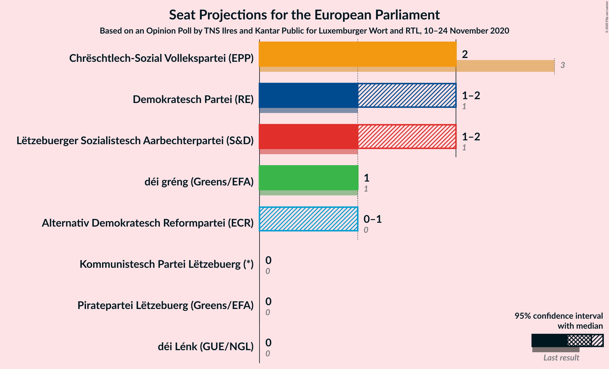

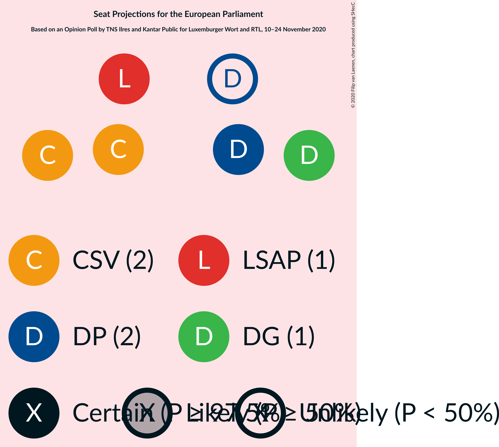

### Confidence Intervals

| Party | Last Result | Median | 80% Confidence Interval | 90% Confidence Interval | 95% Confidence Interval | 99% Confidence Interval |
|:-----:|:-----------:|:------:|:-----------------------:|:-----------------------:|:-----------------------:|:-----------------------:|
| <a href="#chrëschtlech-sozial-vollekspartei-(epp)">Chrëschtlech-Sozial Vollekspartei (EPP)</a> | 3 | 2 | 2 |2 |2 |2 |
| <a href="#demokratesch-partei-(re)">Demokratesch Partei (RE)</a> | 1 | 1 | 1–2 |1–2 |1–2 |1–2 |
| <a href="#lëtzebuerger-sozialistesch-aarbechterpartei-(s&d)">Lëtzebuerger Sozialistesch Aarbechterpartei (S&D)</a> | 1 | 1 | 1–2 |1–2 |1–2 |1–2 |
| <a href="#déi-gréng-(greens/efa)">déi gréng (Greens/EFA)</a> | 1 | 1 | 1 |1 |1 |0–1 |
| <a href="#alternativ-demokratesch-reformpartei-(ecr)">Alternativ Demokratesch Reformpartei (ECR)</a> | 0 | 0 | 0–1 |0–1 |0–1 |0–1 |
| <a href="#piratepartei-lëtzebuerg-(greens/efa)">Piratepartei Lëtzebuerg (Greens/EFA)</a> | 0 | 0 | 0 |0 |0 |0 |
| <a href="#déi-lénk-(gue/ngl)">déi Lénk (GUE/NGL)</a> | 0 | 0 | 0 |0 |0 |0 |
| <a href="#kommunistesch-partei-lëtzebuerg-(*)">Kommunistesch Partei Lëtzebuerg (*)</a> | 0 | 0 | 0 |0 |0 |0 |

### Chrëschtlech-Sozial Vollekspartei (EPP)

*For a full overview of the results for this party, see the [Chrëschtlech-Sozial Vollekspartei (EPP)](party-chrëschtlech-sozialvolleksparteiepp.html) page.*

| Number of Seats | Probability | Accumulated | Special Marks |
|:---------------:|:-----------:|:-----------:|:-------------:|
| 2 | 99.9% | 100% | Median |
| 3 | 0.1% | 0.1% | Last Result |
| 4 | 0% | 0% | Majority |

### Demokratesch Partei (RE)

*For a full overview of the results for this party, see the [Demokratesch Partei (RE)](party-demokrateschparteire.html) page.*

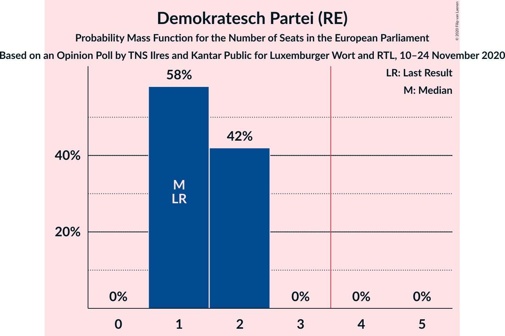

| Number of Seats | Probability | Accumulated | Special Marks |
|:---------------:|:-----------:|:-----------:|:-------------:|
| 1 | 58% | 100% | Last Result, Median |
| 2 | 42% | 42% |  |
| 3 | 0% | 0% |  |

### Lëtzebuerger Sozialistesch Aarbechterpartei (S&D)

*For a full overview of the results for this party, see the [Lëtzebuerger Sozialistesch Aarbechterpartei (S&D)](party-lëtzebuergersozialisteschaarbechterparteisd.html) page.*

| Number of Seats | Probability | Accumulated | Special Marks |
|:---------------:|:-----------:|:-----------:|:-------------:|
| 1 | 63% | 100% | Last Result, Median |
| 2 | 37% | 37% |  |
| 3 | 0% | 0% |  |

### déi gréng (Greens/EFA)

*For a full overview of the results for this party, see the [déi gréng (Greens/EFA)](party-déigrénggreensefa.html) page.*

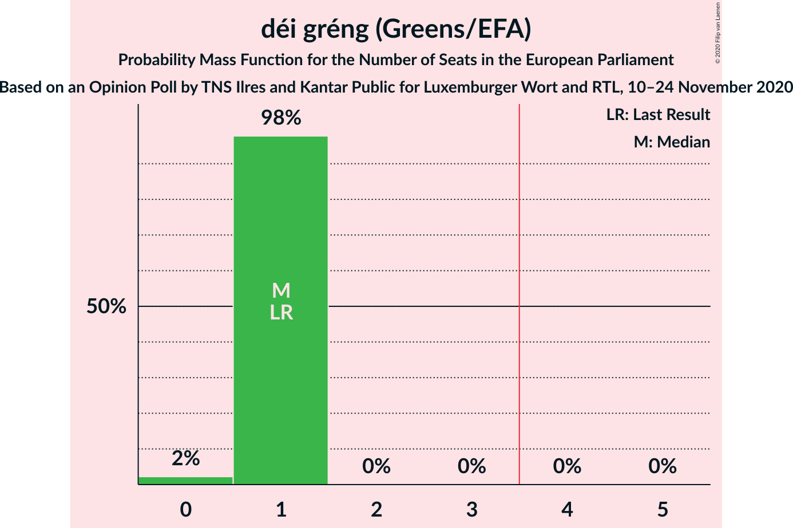

| Number of Seats | Probability | Accumulated | Special Marks |
|:---------------:|:-----------:|:-----------:|:-------------:|
| 0 | 2% | 100% |  |
| 1 | 98% | 98% | Last Result, Median |
| 2 | 0% | 0% |  |

### Alternativ Demokratesch Reformpartei (ECR)

*For a full overview of the results for this party, see the [Alternativ Demokratesch Reformpartei (ECR)](party-alternativdemokrateschreformparteiecr.html) page.*

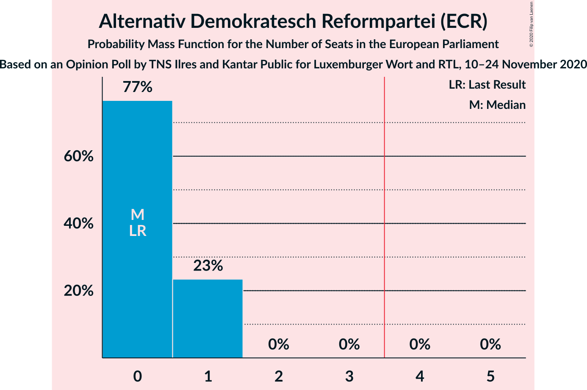

| Number of Seats | Probability | Accumulated | Special Marks |
|:---------------:|:-----------:|:-----------:|:-------------:|
| 0 | 77% | 100% | Last Result, Median |
| 1 | 23% | 23% |  |
| 2 | 0% | 0% |  |

### Piratepartei Lëtzebuerg (Greens/EFA)

*For a full overview of the results for this party, see the [Piratepartei Lëtzebuerg (Greens/EFA)](party-pirateparteilëtzebuerggreensefa.html) page.*

| Number of Seats | Probability | Accumulated | Special Marks |
|:---------------:|:-----------:|:-----------:|:-------------:|
| 0 | 100% | 100% | Last Result, Median |

### déi Lénk (GUE/NGL)

*For a full overview of the results for this party, see the [déi Lénk (GUE/NGL)](party-déilénkguengl.html) page.*

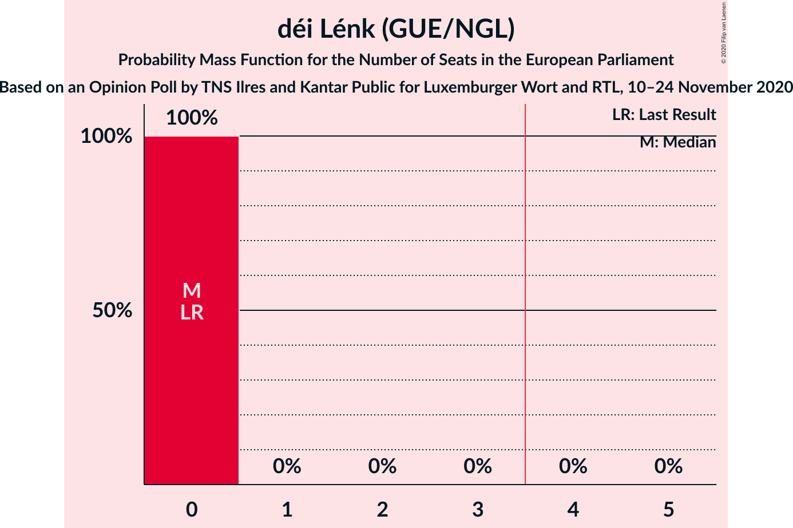

| Number of Seats | Probability | Accumulated | Special Marks |
|:---------------:|:-----------:|:-----------:|:-------------:|
| 0 | 100% | 100% | Last Result, Median |

### Kommunistesch Partei Lëtzebuerg (*)

*For a full overview of the results for this party, see the [Kommunistesch Partei Lëtzebuerg (*)](party-kommunisteschparteilëtzebuerg.html) page.*

| Number of Seats | Probability | Accumulated | Special Marks |
|:---------------:|:-----------:|:-----------:|:-------------:|
| 0 | 100% | 100% | Last Result, Median |

## Coalitions

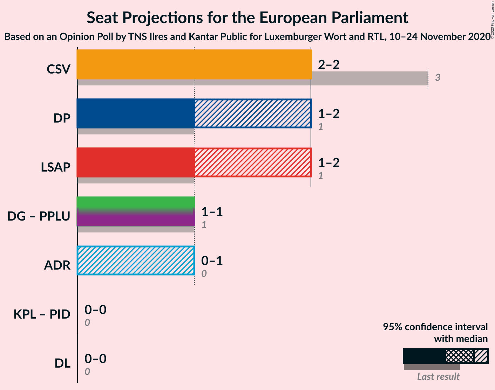

### Confidence Intervals

| Coalition | Last Result | Median | Majority? | 80% Confidence Interval | 90% Confidence Interval | 95% Confidence Interval | 99% Confidence Interval |
|:---------:|:-----------:|:------:|:---------:|:-----------------------:|:-----------------------:|:-----------------------:|:-----------------------:|
| Chrëschtlech-Sozial Vollekspartei (EPP) | 3 | 2 | 0% | 2 | 2 | 2 | 2 |
| Demokratesch Partei (RE) | 1 | 1 | 0% | 1–2 | 1–2 | 1–2 | 1–2 |
| Lëtzebuerger Sozialistesch Aarbechterpartei (S&D) | 1 | 1 | 0% | 1–2 | 1–2 | 1–2 | 1–2 |
| déi gréng (Greens/EFA) – Piratepartei Lëtzebuerg (Greens/EFA) | 1 | 1 | 0% | 1 | 1 | 1 | 0–1 |
| Alternativ Demokratesch Reformpartei (ECR) | 0 | 0 | 0% | 0–1 | 0–1 | 0–1 | 0–1 |
| déi Lénk (GUE/NGL) | 0 | 0 | 0% | 0 | 0 | 0 | 0 |

### Chrëschtlech-Sozial Vollekspartei (EPP)

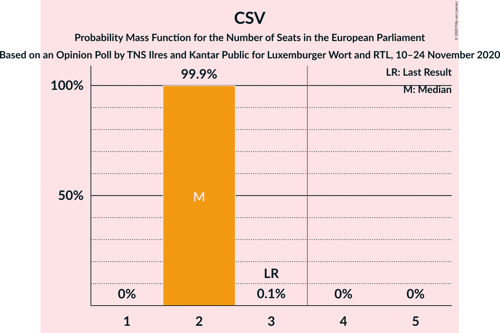

| Number of Seats | Probability | Accumulated | Special Marks |
|:---------------:|:-----------:|:-----------:|:-------------:|
| 2 | 99.9% | 100% | Median |
| 3 | 0.1% | 0.1% | Last Result |
| 4 | 0% | 0% | Majority |

### Demokratesch Partei (RE)

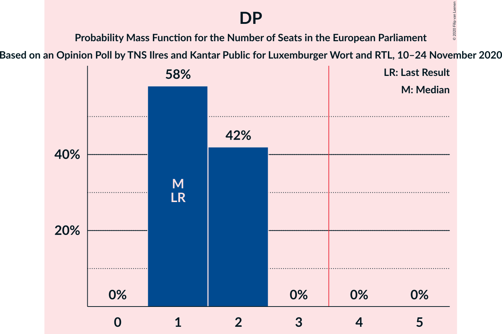

| Number of Seats | Probability | Accumulated | Special Marks |
|:---------------:|:-----------:|:-----------:|:-------------:|
| 1 | 58% | 100% | Last Result, Median |
| 2 | 42% | 42% |  |
| 3 | 0% | 0% |  |

### Lëtzebuerger Sozialistesch Aarbechterpartei (S&D)

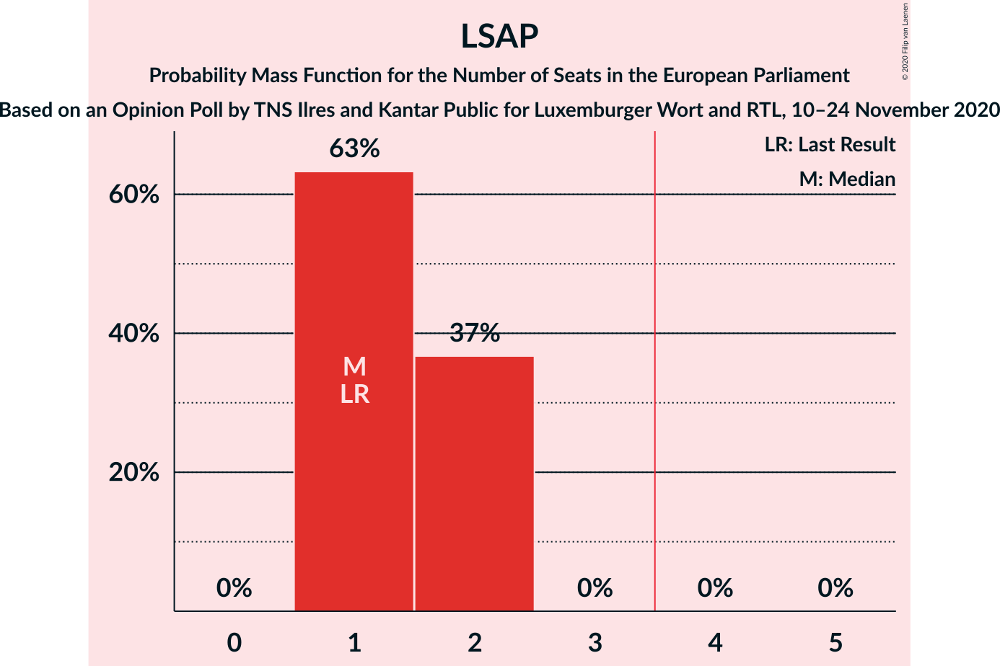

| Number of Seats | Probability | Accumulated | Special Marks |
|:---------------:|:-----------:|:-----------:|:-------------:|
| 1 | 63% | 100% | Last Result, Median |
| 2 | 37% | 37% |  |
| 3 | 0% | 0% |  |

### déi gréng (Greens/EFA) – Piratepartei Lëtzebuerg (Greens/EFA)

| Number of Seats | Probability | Accumulated | Special Marks |
|:---------------:|:-----------:|:-----------:|:-------------:|
| 0 | 2% | 100% |  |
| 1 | 98% | 98% | Last Result, Median |
| 2 | 0% | 0% |  |

### Alternativ Demokratesch Reformpartei (ECR)

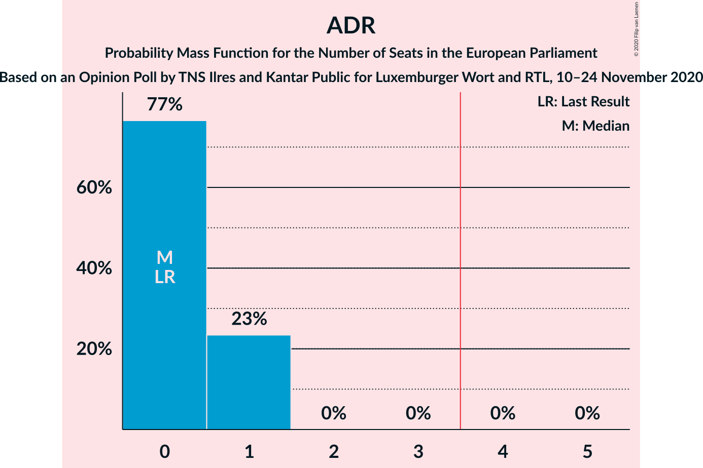

| Number of Seats | Probability | Accumulated | Special Marks |
|:---------------:|:-----------:|:-----------:|:-------------:|
| 0 | 77% | 100% | Last Result, Median |
| 1 | 23% | 23% |  |
| 2 | 0% | 0% |  |

### déi Lénk (GUE/NGL)

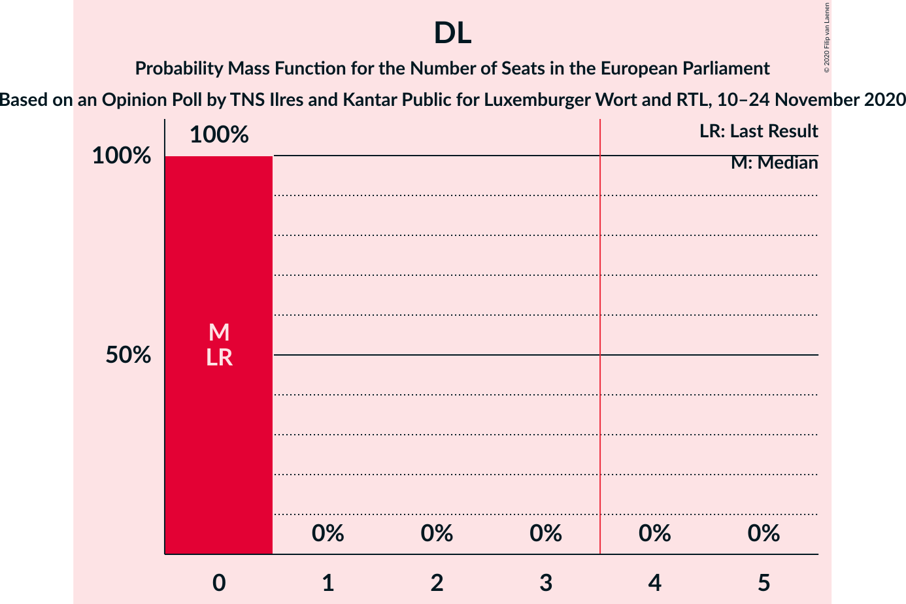

| Number of Seats | Probability | Accumulated | Special Marks |
|:---------------:|:-----------:|:-----------:|:-------------:|
| 0 | 100% | 100% | Last Result, Median |

## Technical Information

### Opinion Poll

+ **Polling firm:** TNS Ilres and Kantar Public
+ **Commissioner(s):** Luxemburger Wort and RTL
+ **Fieldwork period:** 10–24 November 2020

### Calculations

+ **Sample size:** 1879
+ **Simulations done:** 1,048,576
+ **Error estimate:** 1.45%

