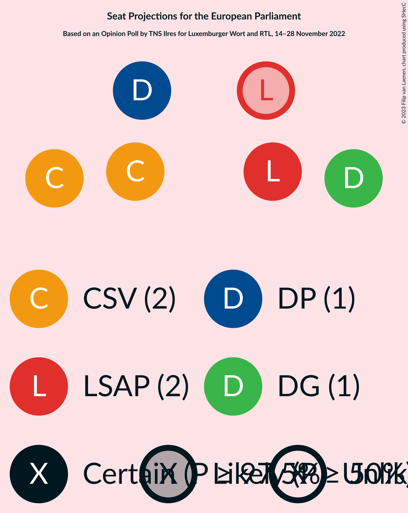
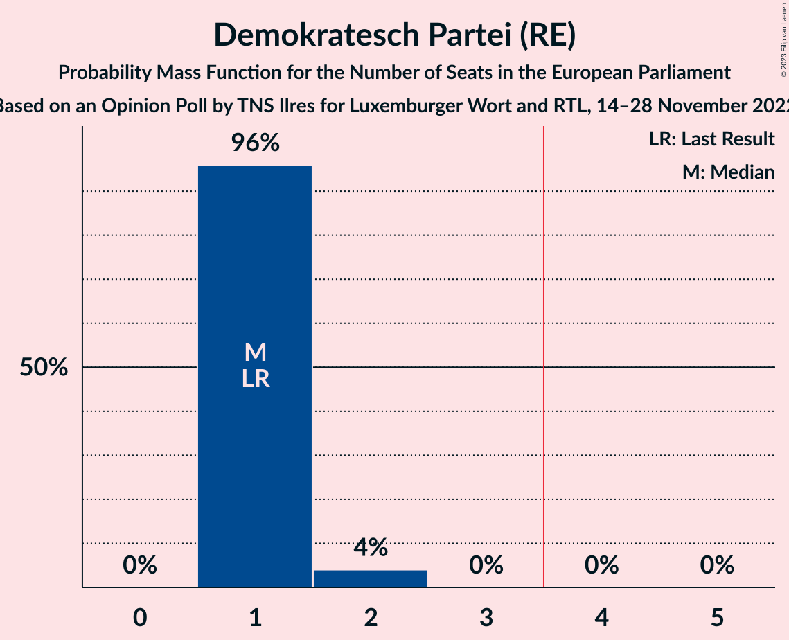
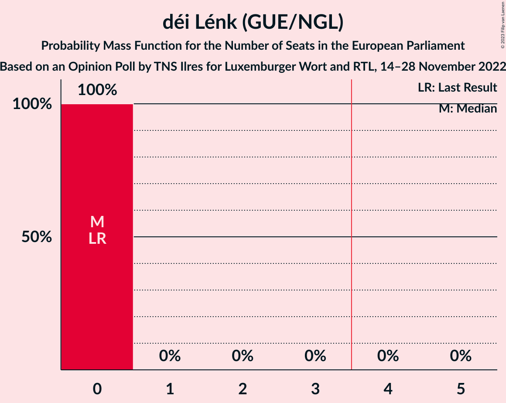
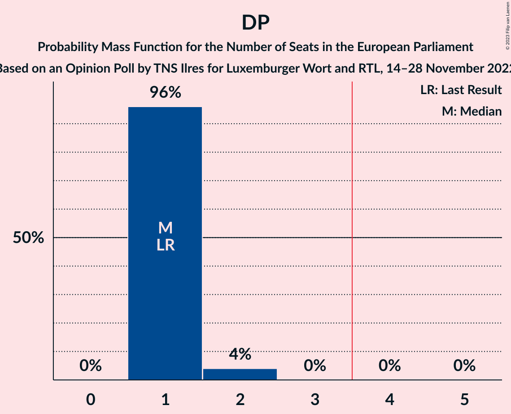
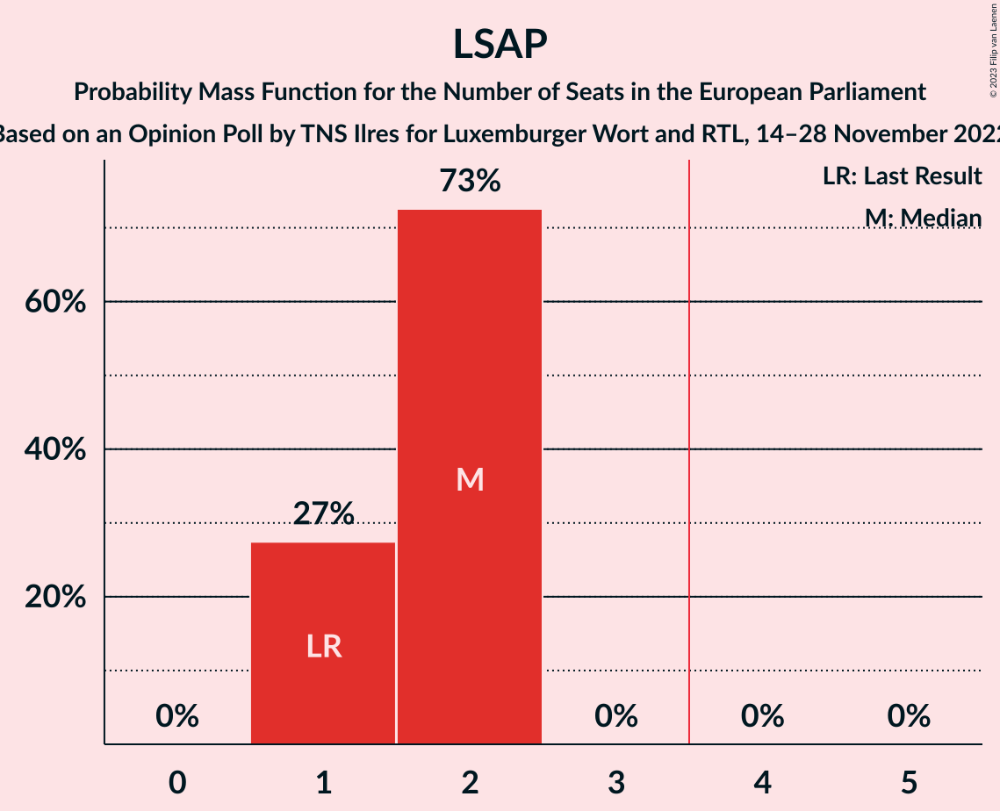

# Opinion Poll by TNS Ilres for Luxemburger Wort and RTL, 14–28 November 2022

<a href="#voting-intentions">Voting Intentions</a> | <a href="#seats">Seats</a> | <a href="#coalitions">Coalitions</a> | <a href="#technical-information">Technical Information</a>

## Voting Intentions

### Confidence Intervals

| Party | Last Result | Poll Result | 80% Confidence Interval | 90% Confidence Interval | 95% Confidence Interval | 99% Confidence Interval |
|:-----:|:-----------:|:-----------:|:-----------------------:|:-----------------------:|:-----------------------:|:-----------------------:|
| Chrëschtlech-Sozial Vollekspartei (EPP) | 37.6% | 23.4% | 22.1–24.7% |21.8–25.1% |21.5–25.4% |20.9–26.0% |
| Lëtzebuerger Sozialistesch Aarbechterpartei (S&D) | 11.8% | 20.8% | 19.6–22.0% |19.3–22.4% |19.0–22.7% |18.4–23.3% |
| Demokratesch Partei (RE) | 14.8% | 18.5% | 17.4–19.7% |17.0–20.0% |16.8–20.3% |16.2–20.9% |
| déi gréng (Greens/EFA) | 15.0% | 12.1% | 11.2–13.2% |10.9–13.4% |10.7–13.7% |10.3–14.2% |
| Piratepartei Lëtzebuerg (Greens/EFA) | 4.2% | 9.6% | 8.8–10.6% |8.6–10.8% |8.4–11.1% |8.0–11.5% |
| Alternativ Demokratesch Reformpartei (ECR) | 7.5% | 7.7% | 7.0–8.6% |6.8–8.8% |6.6–9.0% |6.2–9.5% |
| déi Lénk (GUE/NGL) | 5.8% | 5.8% | 5.2–6.6% |5.0–6.8% |4.8–7.0% |4.5–7.4% |
| Kommunistesch Partei Lëtzebuerg (*) | 1.5% | 0.5% | 0.3–0.8% |0.3–0.9% |0.3–0.9% |0.2–1.1% |
| Partei fir Integral Demokratie (*) | 1.8% | 0.3% | 0.2–0.6% |0.2–0.7% |0.2–0.7% |0.1–0.9% |

*Note:* The poll result column reflects the actual value used in the calculations. Published results may vary slightly, and in addition be rounded to fewer digits.

## Seats

### Confidence Intervals

| Party | Last Result | Median | 80% Confidence Interval | 90% Confidence Interval | 95% Confidence Interval | 99% Confidence Interval |
|:-----:|:-----------:|:------:|:-----------------------:|:-----------------------:|:-----------------------:|:-----------------------:|
| <a href="#chrëschtlech-sozial-vollekspartei-(epp)">Chrëschtlech-Sozial Vollekspartei (EPP)</a> | 3 | 2 | 2 |2 |2 |2 |
| <a href="#lëtzebuerger-sozialistesch-aarbechterpartei-(s&d)">Lëtzebuerger Sozialistesch Aarbechterpartei (S&D)</a> | 1 | 2 | 1–2 |1–2 |1–2 |1–2 |
| <a href="#demokratesch-partei-(re)">Demokratesch Partei (RE)</a> | 1 | 1 | 1 |1 |1–2 |1–2 |
| <a href="#déi-gréng-(greens/efa)">déi gréng (Greens/EFA)</a> | 1 | 1 | 1 |1 |1 |1 |
| <a href="#piratepartei-lëtzebuerg-(greens/efa)">Piratepartei Lëtzebuerg (Greens/EFA)</a> | 0 | 0 | 0–1 |0–1 |0–1 |0–1 |
| <a href="#alternativ-demokratesch-reformpartei-(ecr)">Alternativ Demokratesch Reformpartei (ECR)</a> | 0 | 0 | 0 |0 |0 |0 |
| <a href="#déi-lénk-(gue/ngl)">déi Lénk (GUE/NGL)</a> | 0 | 0 | 0 |0 |0 |0 |
| <a href="#kommunistesch-partei-lëtzebuerg-(*)">Kommunistesch Partei Lëtzebuerg (*)</a> | 0 | 0 | 0 |0 |0 |0 |
| <a href="#partei-fir-integral-demokratie-(*)">Partei fir Integral Demokratie (*)</a> | 0 | 0 | 0 |0 |0 |0 |

### Chrëschtlech-Sozial Vollekspartei (EPP)

*For a full overview of the results for this party, see the [Chrëschtlech-Sozial Vollekspartei (EPP)](party-chrëschtlech-sozialvolleksparteiepp.html) page.*

| Number of Seats | Probability | Accumulated | Special Marks |
|:---------------:|:-----------:|:-----------:|:-------------:|
| 1 | 0.2% | 100% |  |
| 2 | 99.8% | 99.8% | Median |
| 3 | 0% | 0% | Last Result |

### Lëtzebuerger Sozialistesch Aarbechterpartei (S&D)

*For a full overview of the results for this party, see the [Lëtzebuerger Sozialistesch Aarbechterpartei (S&D)](party-lëtzebuergersozialisteschaarbechterparteisd.html) page.*

| Number of Seats | Probability | Accumulated | Special Marks |
|:---------------:|:-----------:|:-----------:|:-------------:|
| 1 | 24% | 100% | Last Result |
| 2 | 76% | 76% | Median |
| 3 | 0% | 0% |  |

### Demokratesch Partei (RE)

*For a full overview of the results for this party, see the [Demokratesch Partei (RE)](party-demokrateschparteire.html) page.*

| Number of Seats | Probability | Accumulated | Special Marks |
|:---------------:|:-----------:|:-----------:|:-------------:|
| 1 | 96% | 100% | Last Result, Median |
| 2 | 4% | 4% |  |
| 3 | 0% | 0% |  |

### déi gréng (Greens/EFA)

*For a full overview of the results for this party, see the [déi gréng (Greens/EFA)](party-déigrénggreensefa.html) page.*

| Number of Seats | Probability | Accumulated | Special Marks |
|:---------------:|:-----------:|:-----------:|:-------------:|
| 0 | 0.4% | 100% |  |
| 1 | 99.6% | 99.6% | Last Result, Median |
| 2 | 0% | 0% |  |

### Piratepartei Lëtzebuerg (Greens/EFA)

*For a full overview of the results for this party, see the [Piratepartei Lëtzebuerg (Greens/EFA)](party-pirateparteilëtzebuerggreensefa.html) page.*

| Number of Seats | Probability | Accumulated | Special Marks |
|:---------------:|:-----------:|:-----------:|:-------------:|
| 0 | 79% | 100% | Last Result, Median |
| 1 | 21% | 21% |  |
| 2 | 0% | 0% |  |

### Alternativ Demokratesch Reformpartei (ECR)

*For a full overview of the results for this party, see the [Alternativ Demokratesch Reformpartei (ECR)](party-alternativdemokrateschreformparteiecr.html) page.*

| Number of Seats | Probability | Accumulated | Special Marks |
|:---------------:|:-----------:|:-----------:|:-------------:|
| 0 | 99.9% | 100% | Last Result, Median |
| 1 | 0.1% | 0.1% |  |
| 2 | 0% | 0% |  |

### déi Lénk (GUE/NGL)

*For a full overview of the results for this party, see the [déi Lénk (GUE/NGL)](party-déilénkguengl.html) page.*

| Number of Seats | Probability | Accumulated | Special Marks |
|:---------------:|:-----------:|:-----------:|:-------------:|
| 0 | 100% | 100% | Last Result, Median |

### Kommunistesch Partei Lëtzebuerg (*)

*For a full overview of the results for this party, see the [Kommunistesch Partei Lëtzebuerg (*)](party-kommunisteschparteilëtzebuerg.html) page.*

| Number of Seats | Probability | Accumulated | Special Marks |
|:---------------:|:-----------:|:-----------:|:-------------:|
| 0 | 100% | 100% | Last Result, Median |

### Partei fir Integral Demokratie (*)

*For a full overview of the results for this party, see the [Partei fir Integral Demokratie (*)](party-parteifirintegraldemokratie.html) page.*

| Number of Seats | Probability | Accumulated | Special Marks |
|:---------------:|:-----------:|:-----------:|:-------------:|
| 0 | 100% | 100% | Last Result, Median |

## Coalitions

### Confidence Intervals

| Coalition | Last Result | Median | Majority? | 80% Confidence Interval | 90% Confidence Interval | 95% Confidence Interval | 99% Confidence Interval |
|:---------:|:-----------:|:------:|:---------:|:-----------------------:|:-----------------------:|:-----------------------:|:-----------------------:|
| Chrëschtlech-Sozial Vollekspartei (EPP) | 3 | 2 | 0% | 2 | 2 | 2 | 2 |
| Demokratesch Partei (RE) | 1 | 1 | 0% | 1 | 1 | 1–2 | 1–2 |
| Lëtzebuerger Sozialistesch Aarbechterpartei (S&D) | 1 | 2 | 0% | 1–2 | 1–2 | 1–2 | 1–2 |
| déi gréng (Greens/EFA) – Piratepartei Lëtzebuerg (Greens/EFA) | 1 | 1 | 0% | 1–2 | 1–2 | 1–2 | 1–2 |
| Alternativ Demokratesch Reformpartei (ECR) | 0 | 0 | 0% | 0 | 0 | 0 | 0 |
| Kommunistesch Partei Lëtzebuerg (*) – Partei fir Integral Demokratie (*) | 0 | 0 | 0% | 0 | 0 | 0 | 0 |
| déi Lénk (GUE/NGL) | 0 | 0 | 0% | 0 | 0 | 0 | 0 |

### Chrëschtlech-Sozial Vollekspartei (EPP)

| Number of Seats | Probability | Accumulated | Special Marks |
|:---------------:|:-----------:|:-----------:|:-------------:|
| 1 | 0.2% | 100% |  |
| 2 | 99.8% | 99.8% | Median |
| 3 | 0% | 0% | Last Result |

### Demokratesch Partei (RE)

| Number of Seats | Probability | Accumulated | Special Marks |
|:---------------:|:-----------:|:-----------:|:-------------:|
| 1 | 96% | 100% | Last Result, Median |
| 2 | 4% | 4% |  |
| 3 | 0% | 0% |  |

### Lëtzebuerger Sozialistesch Aarbechterpartei (S&D)

| Number of Seats | Probability | Accumulated | Special Marks |
|:---------------:|:-----------:|:-----------:|:-------------:|
| 1 | 24% | 100% | Last Result |
| 2 | 76% | 76% | Median |
| 3 | 0% | 0% |  |

### déi gréng (Greens/EFA) – Piratepartei Lëtzebuerg (Greens/EFA)

| Number of Seats | Probability | Accumulated | Special Marks |
|:---------------:|:-----------:|:-----------:|:-------------:|
| 1 | 80% | 100% | Last Result, Median |
| 2 | 20% | 20% |  |
| 3 | 0% | 0% |  |

### Alternativ Demokratesch Reformpartei (ECR)

| Number of Seats | Probability | Accumulated | Special Marks |
|:---------------:|:-----------:|:-----------:|:-------------:|
| 0 | 99.9% | 100% | Last Result, Median |
| 1 | 0.1% | 0.1% |  |
| 2 | 0% | 0% |  |

### Kommunistesch Partei Lëtzebuerg (*) – Partei fir Integral Demokratie (*)

| Number of Seats | Probability | Accumulated | Special Marks |
|:---------------:|:-----------:|:-----------:|:-------------:|
| 0 | 100% | 100% | Last Result, Median |

### déi Lénk (GUE/NGL)

| Number of Seats | Probability | Accumulated | Special Marks |
|:---------------:|:-----------:|:-----------:|:-------------:|
| 0 | 100% | 100% | Last Result, Median |

## Technical Information

### Opinion Poll

+ **Polling firm:** TNS Ilres
+ **Commissioner(s):** Luxemburger Wort and RTL
+ **Fieldwork period:** 14–28 November 2022

### Calculations

+ **Sample size:** 1839
+ **Simulations done:** 1,048,576
+ **Error estimate:** 1.23%

