# Poll Average

<a href="#voting-intentions">Voting Intentions</a> | <a href="#seats">Seats</a> | <a href="#coalitions">Coalitions</a> | <a href="#technical-information">Technical Information</a>

## Summary

The table below lists the polls on which the average is based. They are the most recent polls (less than 30 days old) registered and analyzed so far.

| Period     | Polling firm/Commissioner(s) | CSV | DG | DP | LSAP | ADR | DL | PPLU | PID | KPL | DK | DEM | VOLT | FOKUS |
|:----------:|:----------------------------:|:--:|:--:|:--:|:--:|:--:|:--:|:--:|:--:|:--:|:--:|:--:|:--:|:--:|
| 26 May 2019 | General Election | 37.6%   3 | 15.0%   1 | 14.8%   1 | 11.8%   1 | 7.5%   0 | 5.8%   0 | 4.2%   0 | 1.8%   0 | 1.5%   0 | 0.0%   0 | 0.0%   0 | 0.0%   0 | 0.0%   0 |
| N/A | Poll Average | 26–30%   2–3 | 9–12%   0–1 | 16–19%   1–2 | 18–22%   1–2 | 6–8%   0 | 4–6%   0 | 8–11%   0–1 | N/A   N/A | 0–1%   0 | 0%   0 | 0%   0 | 0%   0 | 1–2%   0 |
| [7–16 August 2023](2023-08-16-Ilres.html) | Ilres   Luxemburger Wort and RTL | 26–30%   2–3 | 9–12%   0–1 | 16–19%   1–2 | 18–22%   1–2 | 6–8%   0 | 4–6%   0 | 8–11%   0–1 | N/A   N/A | 0–1%   0 | 0%   0 | 0%   0 | 0%   0 | 1–2%   0 |
| 26 May 2019 | General Election | 37.6%   3 | 15.0%   1 | 14.8%   1 | 11.8%   1 | 7.5%   0 | 5.8%   0 | 4.2%   0 | 1.8%   0 | 1.5%   0 | 0.0%   0 | 0.0%   0 | 0.0%   0 | 0.0%   0 |

Only polls for which at least the sample size has been published are included in the table above.

**Legend:**
+ **Top half of each row:** Voting intentions (95% confidence interval)
+ **Bottom half of each row:** Seat projections for the European Parliament (95% confidence interval)
+ **CSV:** Chrëschtlech-Sozial Vollekspartei (EPP)
+ **DG:** déi gréng (Greens/EFA)
+ **DP:** Demokratesch Partei (RE)
+ **LSAP:** Lëtzebuerger Sozialistesch Aarbechterpartei (S&D)
+ **ADR:** Alternativ Demokratesch Reformpartei (ECR)
+ **DL:** déi Lénk (GUE/NGL)
+ **PPLU:** Piratepartei Lëtzebuerg (Greens/EFA)
+ **PID:** Partei fir Integral Demokratie (*)
+ **KPL:** Kommunistesch Partei Lëtzebuerg (*)
+ **DK:** Déi Konservativ (*)
+ **DEM:** Demokratie (*)
+ **VOLT:** Volt Lëtzebuerg (Greens/EFA)
+ **FOKUS:** Fokus (*)
+ **N/A (single party):** Party not included the published results
+ **N/A (entire row):** Calculation for this opinion poll not started yet

## Voting Intentions

### Confidence Intervals

| Party | Last Result | Median | 80% Confidence Interval | 90% Confidence Interval | 95% Confidence Interval | 99% Confidence Interval |
|:-----:|:-----------:|:------:|:-----------------------:|:-----------------------:|:-----------------------:|:-----------------------:|
| <a href="#chrëschtlech-sozial-vollekspartei-(epp)">Chrëschtlech-Sozial Vollekspartei (EPP)</a> | 37.6% | 28.3% | 27.0–29.7% |26.6–30.0% | 26.3–30.4% | 25.7–31.0% |
| <a href="#déi-gréng-(greens/efa)">déi gréng (Greens/EFA)</a> | 15.0% | 10.7% | 9.8–11.7% |9.6–11.9% | 9.4–12.2% | 9.0–12.7% |
| <a href="#demokratesch-partei-(re)">Demokratesch Partei (RE)</a> | 14.8% | 17.4% | 16.3–18.5% |16.0–18.9% | 15.7–19.2% | 15.2–19.7% |
| <a href="#lëtzebuerger-sozialistesch-aarbechterpartei-(s&d)">Lëtzebuerger Sozialistesch Aarbechterpartei (S&D)</a> | 11.8% | 19.8% | 18.7–21.0% |18.4–21.4% | 18.1–21.7% | 17.6–22.3% |
| <a href="#alternativ-demokratesch-reformpartei-(ecr)">Alternativ Demokratesch Reformpartei (ECR)</a> | 7.5% | 6.9% | 6.2–7.7% |6.0–7.9% | 5.8–8.1% | 5.5–8.5% |
| <a href="#déi-lénk-(gue/ngl)">déi Lénk (GUE/NGL)</a> | 5.8% | 5.0% | 4.4–5.7% |4.2–5.9% | 4.1–6.1% | 3.8–6.4% |
| <a href="#piratepartei-lëtzebuerg-(greens/efa)">Piratepartei Lëtzebuerg (Greens/EFA)</a> | 4.2% | 9.6% | 8.8–10.5% |8.5–10.8% | 8.3–11.0% | 8.0–11.5% |
| <a href="#partei-fir-integral-demokratie-(*)">Partei fir Integral Demokratie (*)</a> | 1.8% | N/A | N/A |N/A | N/A | N/A |
| <a href="#kommunistesch-partei-lëtzebuerg-(*)">Kommunistesch Partei Lëtzebuerg (*)</a> | 1.5% | 0.5% | 0.3–0.7% |0.3–0.8% | 0.2–0.8% | 0.2–1.0% |
| <a href="#déi-konservativ-(*)">Déi Konservativ (*)</a> | 0.0% | 0.1% | 0.1–0.3% |0.0–0.3% | 0.0–0.4% | 0.0–0.5% |
| <a href="#demokratie-(*)">Demokratie (*)</a> | 0.0% | 0.0% | 0.0–0.1% |0.0–0.2% | 0.0–0.2% | 0.0–0.3% |
| <a href="#volt-lëtzebuerg-(greens/efa)">Volt Lëtzebuerg (Greens/EFA)</a> | 0.0% | 0.0% | 0.0–0.1% |0.0–0.2% | 0.0–0.2% | 0.0–0.3% |
| <a href="#fokus-(*)">Fokus (*)</a> | 0.0% | 1.2% | 0.9–1.5% |0.8–1.6% | 0.7–1.7% | 0.6–1.9% |

### Chrëschtlech-Sozial Vollekspartei (EPP)

*For a full overview of the results for this party, see the [Chrëschtlech-Sozial Vollekspartei (EPP)](party-chrëschtlech-sozialvolleksparteiepp.html) page.*

| Voting Intentions | Probability | Accumulated | Special Marks |
|:-----------------:|:-----------:|:-----------:|:-------------:|
| 23.5–24.5% | 0% | 100% |  |
| 24.5–25.5% | 0.3% | 100% |  |
| 25.5–26.5% | 4% | 99.7% |  |
| 26.5–27.5% | 19% | 96% |  |
| 27.5–28.5% | 36% | 77% | Median |
| 28.5–29.5% | 29% | 41% |  |
| 29.5–30.5% | 10% | 12% |  |
| 30.5–31.5% | 2% | 2% |  |
| 31.5–32.5% | 0.1% | 0.1% |  |
| 32.5–33.5% | 0% | 0% |  |
| 33.5–34.5% | 0% | 0% |  |
| 34.5–35.5% | 0% | 0% |  |
| 35.5–36.5% | 0% | 0% |  |
| 36.5–37.5% | 0% | 0% |  |
| 37.5–38.5% | 0% | 0% | Last Result |

### déi gréng (Greens/EFA)

*For a full overview of the results for this party, see the [déi gréng (Greens/EFA)](party-déigrénggreensefa.html) page.*

| Voting Intentions | Probability | Accumulated | Special Marks |
|:-----------------:|:-----------:|:-----------:|:-------------:|
| 7.5–8.5% | 0.1% | 100% |  |
| 8.5–9.5% | 4% | 99.9% |  |
| 9.5–10.5% | 35% | 96% |  |
| 10.5–11.5% | 47% | 60% | Median |
| 11.5–12.5% | 12% | 13% |  |
| 12.5–13.5% | 0.7% | 0.8% |  |
| 13.5–14.5% | 0% | 0% |  |
| 14.5–15.5% | 0% | 0% | Last Result |

### Demokratesch Partei (RE)

*For a full overview of the results for this party, see the [Demokratesch Partei (RE)](party-demokrateschparteire.html) page.*

| Voting Intentions | Probability | Accumulated | Special Marks |
|:-----------------:|:-----------:|:-----------:|:-------------:|
| 13.5–14.5% | 0% | 100% |  |
| 14.5–15.5% | 1.4% | 100% | Last Result |
| 15.5–16.5% | 15% | 98.6% |  |
| 16.5–17.5% | 40% | 84% | Median |
| 17.5–18.5% | 34% | 44% |  |
| 18.5–19.5% | 9% | 10% |  |
| 19.5–20.5% | 0.8% | 0.8% |  |
| 20.5–21.5% | 0% | 0% |  |

### Lëtzebuerger Sozialistesch Aarbechterpartei (S&D)

*For a full overview of the results for this party, see the [Lëtzebuerger Sozialistesch Aarbechterpartei (S&D)](party-lëtzebuergersozialisteschaarbechterparteisd.html) page.*

| Voting Intentions | Probability | Accumulated | Special Marks |
|:-----------------:|:-----------:|:-----------:|:-------------:|
| 11.5–12.5% | 0% | 100% | Last Result |
| 12.5–13.5% | 0% | 100% |  |
| 13.5–14.5% | 0% | 100% |  |
| 14.5–15.5% | 0% | 100% |  |
| 15.5–16.5% | 0% | 100% |  |
| 16.5–17.5% | 0.5% | 100% |  |
| 17.5–18.5% | 7% | 99.5% |  |
| 18.5–19.5% | 30% | 92% |  |
| 19.5–20.5% | 40% | 62% | Median |
| 20.5–21.5% | 19% | 22% |  |
| 21.5–22.5% | 3% | 3% |  |
| 22.5–23.5% | 0.2% | 0.2% |  |
| 23.5–24.5% | 0% | 0% |  |

### Alternativ Demokratesch Reformpartei (ECR)

*For a full overview of the results for this party, see the [Alternativ Demokratesch Reformpartei (ECR)](party-alternativdemokrateschreformparteiecr.html) page.*

| Voting Intentions | Probability | Accumulated | Special Marks |
|:-----------------:|:-----------:|:-----------:|:-------------:|
| 3.5–4.5% | 0% | 100% |  |
| 4.5–5.5% | 0.6% | 100% |  |
| 5.5–6.5% | 26% | 99.4% |  |
| 6.5–7.5% | 59% | 74% | Median |
| 7.5–8.5% | 14% | 15% | Last Result |
| 8.5–9.5% | 0.4% | 0.4% |  |
| 9.5–10.5% | 0% | 0% |  |

### déi Lénk (GUE/NGL)

*For a full overview of the results for this party, see the [déi Lénk (GUE/NGL)](party-déilénkguengl.html) page.*

| Voting Intentions | Probability | Accumulated | Special Marks |
|:-----------------:|:-----------:|:-----------:|:-------------:|
| 2.5–3.5% | 0.1% | 100% |  |
| 3.5–4.5% | 17% | 99.9% |  |
| 4.5–5.5% | 67% | 83% | Median |
| 5.5–6.5% | 15% | 15% | Last Result |
| 6.5–7.5% | 0.2% | 0.2% |  |
| 7.5–8.5% | 0% | 0% |  |

### Piratepartei Lëtzebuerg (Greens/EFA)

*For a full overview of the results for this party, see the [Piratepartei Lëtzebuerg (Greens/EFA)](party-pirateparteilëtzebuerggreensefa.html) page.*

| Voting Intentions | Probability | Accumulated | Special Marks |
|:-----------------:|:-----------:|:-----------:|:-------------:|
| 3.5–4.5% | 0% | 100% | Last Result |
| 4.5–5.5% | 0% | 100% |  |
| 5.5–6.5% | 0% | 100% |  |
| 6.5–7.5% | 0.1% | 100% |  |
| 7.5–8.5% | 5% | 99.9% |  |
| 8.5–9.5% | 41% | 95% |  |
| 9.5–10.5% | 45% | 54% | Median |
| 10.5–11.5% | 9% | 9% |  |
| 11.5–12.5% | 0.3% | 0.3% |  |
| 12.5–13.5% | 0% | 0% |  |

### Kommunistesch Partei Lëtzebuerg (*)

*For a full overview of the results for this party, see the [Kommunistesch Partei Lëtzebuerg (*)](party-kommunisteschparteilëtzebuerg.html) page.*

| Voting Intentions | Probability | Accumulated | Special Marks |
|:-----------------:|:-----------:|:-----------:|:-------------:|
| 0.0–0.5% | 71% | 100% | Median |
| 0.5–1.5% | 29% | 29% | Last Result |
| 1.5–2.5% | 0% | 0% |  |

### Volt Lëtzebuerg (Greens/EFA)

*For a full overview of the results for this party, see the [Volt Lëtzebuerg (Greens/EFA)](party-voltlëtzebuerggreensefa.html) page.*

| Voting Intentions | Probability | Accumulated | Special Marks |
|:-----------------:|:-----------:|:-----------:|:-------------:|
| 0.0–0.5% | 100% | 100% | Last Result, Median |
| 0.5–1.5% | 0% | 0% |  |

### Déi Konservativ (*)

*For a full overview of the results for this party, see the [Déi Konservativ (*)](party-déikonservativ.html) page.*

| Voting Intentions | Probability | Accumulated | Special Marks |
|:-----------------:|:-----------:|:-----------:|:-------------:|
| 0.0–0.5% | 99.8% | 100% | Last Result, Median |
| 0.5–1.5% | 0.2% | 0.2% |  |
| 1.5–2.5% | 0% | 0% |  |

### Demokratie (*)

*For a full overview of the results for this party, see the [Demokratie (*)](party-demokratie.html) page.*

| Voting Intentions | Probability | Accumulated | Special Marks |
|:-----------------:|:-----------:|:-----------:|:-------------:|
| 0.0–0.5% | 100% | 100% | Last Result, Median |
| 0.5–1.5% | 0% | 0% |  |

### Fokus (*)

*For a full overview of the results for this party, see the [Fokus (*)](party-fokus.html) page.*

| Voting Intentions | Probability | Accumulated | Special Marks |
|:-----------------:|:-----------:|:-----------:|:-------------:|
| 0.0–0.5% | 0.1% | 100% | Last Result |
| 0.5–1.5% | 93% | 99.9% | Median |
| 1.5–2.5% | 7% | 7% |  |
| 2.5–3.5% | 0% | 0% |  |

## Seats

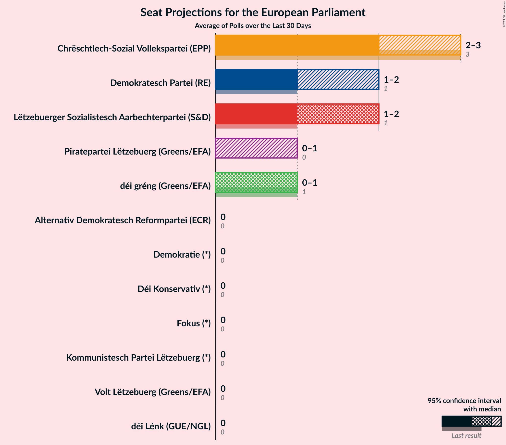

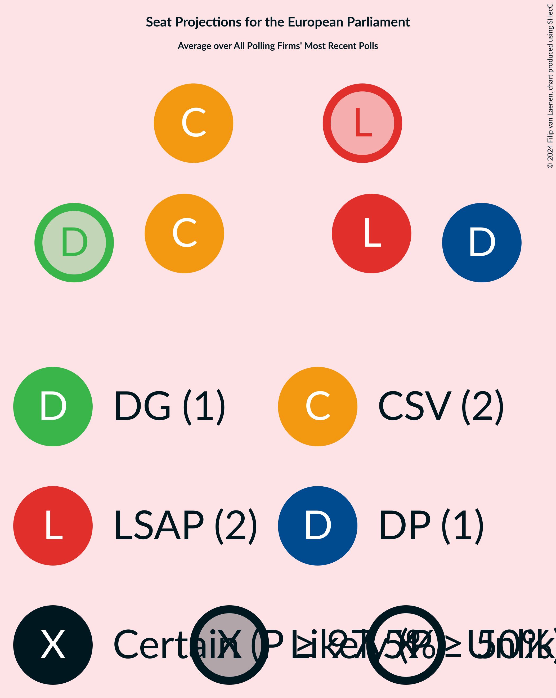

### Confidence Intervals

| Party | Last Result | Median | 80% Confidence Interval | 90% Confidence Interval | 95% Confidence Interval | 99% Confidence Interval |
|:-----:|:-----------:|:------:|:-----------------------:|:-----------------------:|:-----------------------:|:-----------------------:|
| <a href="#chrëschtlech-sozial-vollekspartei-(epp)">Chrëschtlech-Sozial Vollekspartei (EPP)</a> | 3 | 2 | 2–3 |2–3 | 2–3 | 2–3 |
| <a href="#déi-gréng-(greens/efa)">déi gréng (Greens/EFA)</a> | 1 | 1 | 0–1 |0–1 | 0–1 | 0–1 |
| <a href="#demokratesch-partei-(re)">Demokratesch Partei (RE)</a> | 1 | 1 | 1–2 |1–2 | 1–2 | 1–2 |
| <a href="#lëtzebuerger-sozialistesch-aarbechterpartei-(s&d)">Lëtzebuerger Sozialistesch Aarbechterpartei (S&D)</a> | 1 | 2 | 1–2 |1–2 | 1–2 | 1–2 |
| <a href="#alternativ-demokratesch-reformpartei-(ecr)">Alternativ Demokratesch Reformpartei (ECR)</a> | 0 | 0 | 0 |0 | 0 | 0 |
| <a href="#déi-lénk-(gue/ngl)">déi Lénk (GUE/NGL)</a> | 0 | 0 | 0 |0 | 0 | 0 |
| <a href="#piratepartei-lëtzebuerg-(greens/efa)">Piratepartei Lëtzebuerg (Greens/EFA)</a> | 0 | 0 | 0–1 |0–1 | 0–1 | 0–1 |
| <a href="#partei-fir-integral-demokratie-(*)">Partei fir Integral Demokratie (*)</a> | 0 | N/A | N/A |N/A | N/A | N/A |
| <a href="#kommunistesch-partei-lëtzebuerg-(*)">Kommunistesch Partei Lëtzebuerg (*)</a> | 0 | 0 | 0 |0 | 0 | 0 |
| <a href="#déi-konservativ-(*)">Déi Konservativ (*)</a> | 0 | 0 | 0 |0 | 0 | 0 |
| <a href="#demokratie-(*)">Demokratie (*)</a> | 0 | 0 | 0 |0 | 0 | 0 |
| <a href="#volt-lëtzebuerg-(greens/efa)">Volt Lëtzebuerg (Greens/EFA)</a> | 0 | 0 | 0 |0 | 0 | 0 |
| <a href="#fokus-(*)">Fokus (*)</a> | 0 | 0 | 0 |0 | 0 | 0 |

### Chrëschtlech-Sozial Vollekspartei (EPP)

*For a full overview of the results for this party, see the [Chrëschtlech-Sozial Vollekspartei (EPP)](party-chrëschtlech-sozialvolleksparteiepp.html) page.*

| Number of Seats | Probability | Accumulated | Special Marks |
|:---------------:|:-----------:|:-----------:|:-------------:|
| 2 | 78% | 100% | Median |
| 3 | 22% | 22% | Last Result |
| 4 | 0% | 0% | Majority |

### déi gréng (Greens/EFA)

*For a full overview of the results for this party, see the [déi gréng (Greens/EFA)](party-déigrénggreensefa.html) page.*

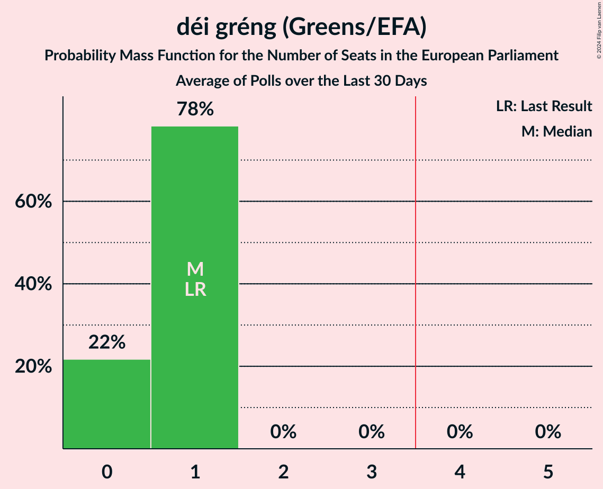

| Number of Seats | Probability | Accumulated | Special Marks |
|:---------------:|:-----------:|:-----------:|:-------------:|
| 0 | 22% | 100% |  |
| 1 | 78% | 78% | Last Result, Median |
| 2 | 0% | 0% |  |

### Demokratesch Partei (RE)

*For a full overview of the results for this party, see the [Demokratesch Partei (RE)](party-demokrateschparteire.html) page.*

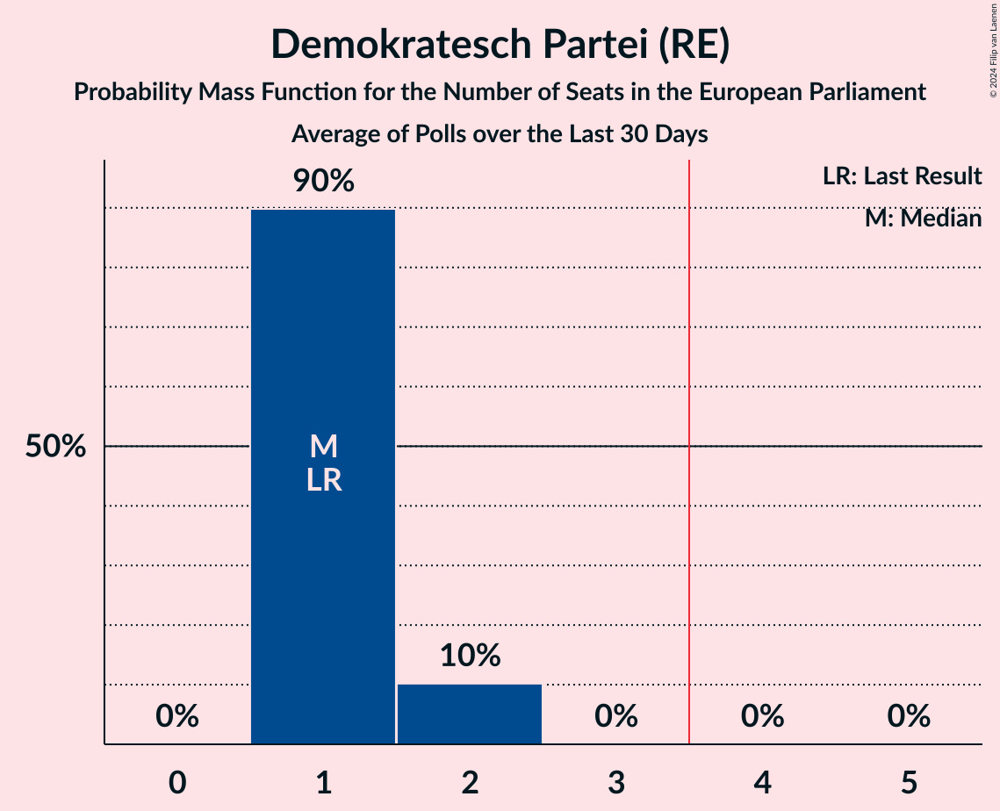

| Number of Seats | Probability | Accumulated | Special Marks |
|:---------------:|:-----------:|:-----------:|:-------------:|
| 1 | 90% | 100% | Last Result, Median |
| 2 | 10% | 10% |  |
| 3 | 0% | 0% |  |

### Lëtzebuerger Sozialistesch Aarbechterpartei (S&D)

*For a full overview of the results for this party, see the [Lëtzebuerger Sozialistesch Aarbechterpartei (S&D)](party-lëtzebuergersozialisteschaarbechterparteisd.html) page.*

| Number of Seats | Probability | Accumulated | Special Marks |
|:---------------:|:-----------:|:-----------:|:-------------:|
| 1 | 33% | 100% | Last Result |
| 2 | 67% | 67% | Median |
| 3 | 0% | 0% |  |

### Alternativ Demokratesch Reformpartei (ECR)

*For a full overview of the results for this party, see the [Alternativ Demokratesch Reformpartei (ECR)](party-alternativdemokrateschreformparteiecr.html) page.*

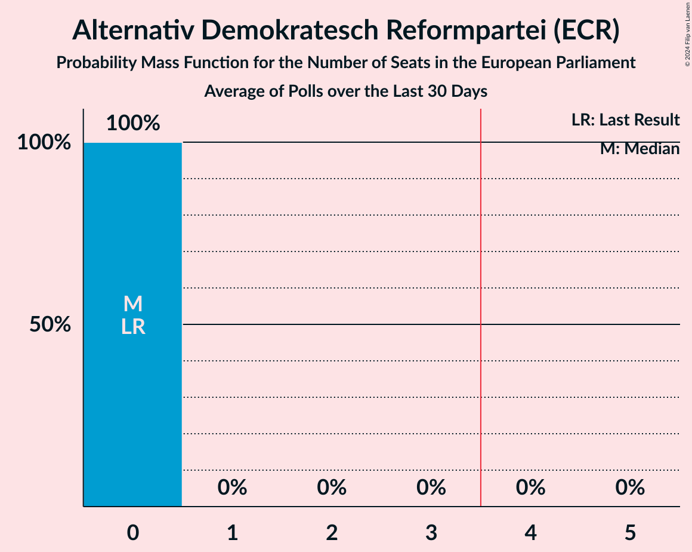

| Number of Seats | Probability | Accumulated | Special Marks |
|:---------------:|:-----------:|:-----------:|:-------------:|
| 0 | 100% | 100% | Last Result, Median |

### déi Lénk (GUE/NGL)

*For a full overview of the results for this party, see the [déi Lénk (GUE/NGL)](party-déilénkguengl.html) page.*

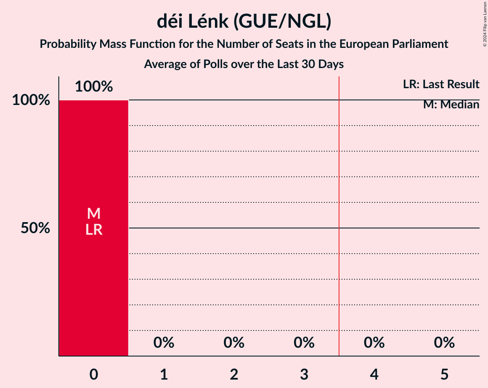

| Number of Seats | Probability | Accumulated | Special Marks |
|:---------------:|:-----------:|:-----------:|:-------------:|
| 0 | 100% | 100% | Last Result, Median |

### Piratepartei Lëtzebuerg (Greens/EFA)

*For a full overview of the results for this party, see the [Piratepartei Lëtzebuerg (Greens/EFA)](party-pirateparteilëtzebuerggreensefa.html) page.*

| Number of Seats | Probability | Accumulated | Special Marks |
|:---------------:|:-----------:|:-----------:|:-------------:|
| 0 | 78% | 100% | Last Result, Median |
| 1 | 22% | 22% |  |
| 2 | 0% | 0% |  |

### Partei fir Integral Demokratie (*)

*For a full overview of the results for this party, see the [Partei fir Integral Demokratie (*)](party-parteifirintegraldemokratie.html) page.*

### Kommunistesch Partei Lëtzebuerg (*)

*For a full overview of the results for this party, see the [Kommunistesch Partei Lëtzebuerg (*)](party-kommunisteschparteilëtzebuerg.html) page.*

| Number of Seats | Probability | Accumulated | Special Marks |
|:---------------:|:-----------:|:-----------:|:-------------:|
| 0 | 100% | 100% | Last Result, Median |

### Déi Konservativ (*)

*For a full overview of the results for this party, see the [Déi Konservativ (*)](party-déikonservativ.html) page.*

| Number of Seats | Probability | Accumulated | Special Marks |
|:---------------:|:-----------:|:-----------:|:-------------:|
| 0 | 100% | 100% | Last Result, Median |

### Demokratie (*)

*For a full overview of the results for this party, see the [Demokratie (*)](party-demokratie.html) page.*

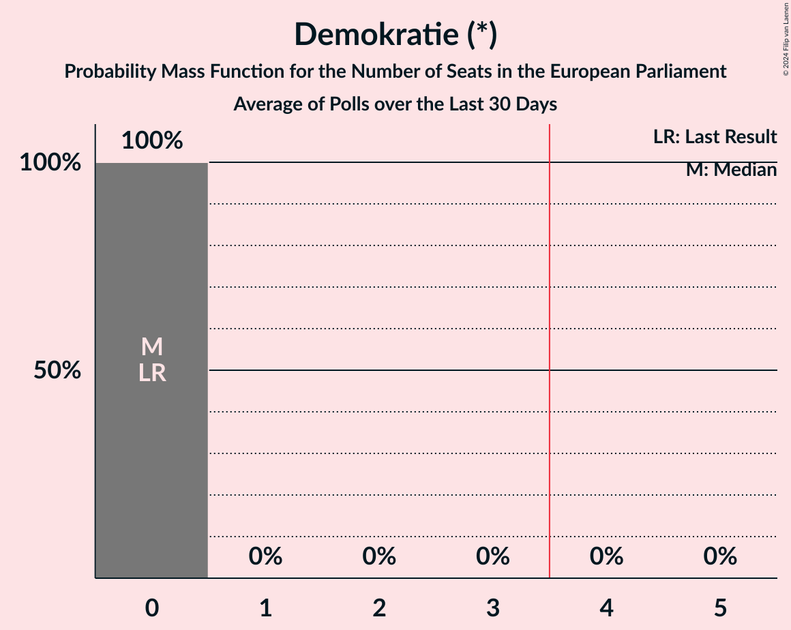

| Number of Seats | Probability | Accumulated | Special Marks |
|:---------------:|:-----------:|:-----------:|:-------------:|
| 0 | 100% | 100% | Last Result, Median |

### Volt Lëtzebuerg (Greens/EFA)

*For a full overview of the results for this party, see the [Volt Lëtzebuerg (Greens/EFA)](party-voltlëtzebuerggreensefa.html) page.*

| Number of Seats | Probability | Accumulated | Special Marks |
|:---------------:|:-----------:|:-----------:|:-------------:|
| 0 | 100% | 100% | Last Result, Median |

### Fokus (*)

*For a full overview of the results for this party, see the [Fokus (*)](party-fokus.html) page.*

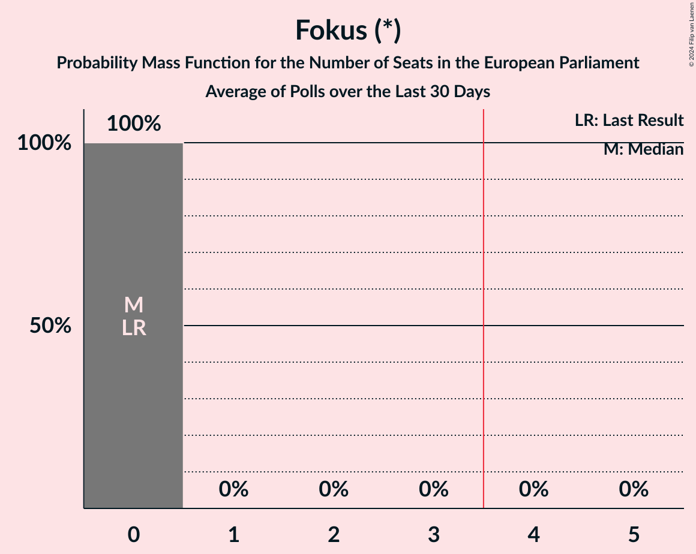

| Number of Seats | Probability | Accumulated | Special Marks |
|:---------------:|:-----------:|:-----------:|:-------------:|
| 0 | 100% | 100% | Last Result, Median |

## Coalitions

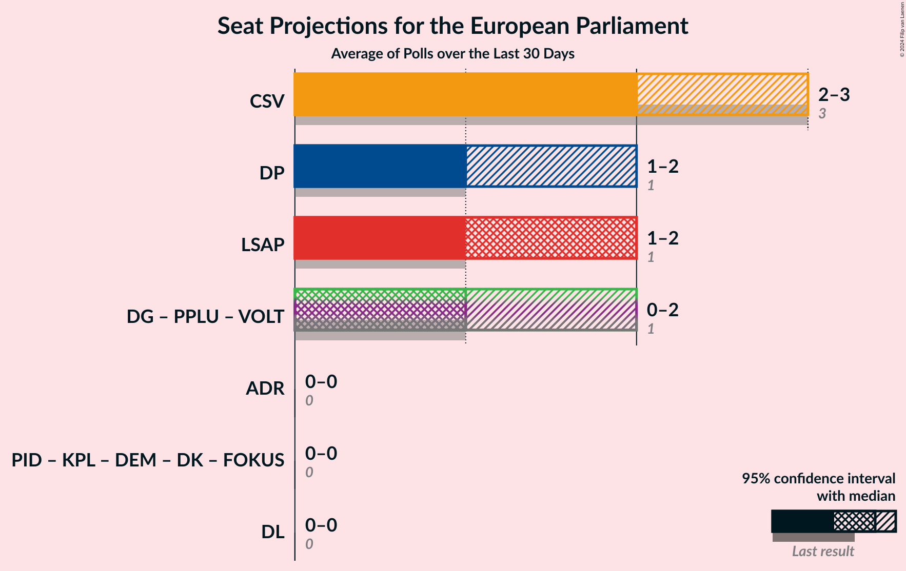

### Confidence Intervals

| Coalition | Last Result | Median | Majority? | 80% Confidence Interval | 90% Confidence Interval | 95% Confidence Interval | 99% Confidence Interval |
|:---------:|:-----------:|:------:|:---------:|:-----------------------:|:-----------------------:|:-----------------------:|:-----------------------:|
| Chrëschtlech-Sozial Vollekspartei (EPP) | 3 | 2 | 0% | 2–3 | 2–3 | 2–3 | 2–3 |
| Demokratesch Partei (RE) | 1 | 1 | 0% | 1–2 | 1–2 | 1–2 | 1–2 |
| Lëtzebuerger Sozialistesch Aarbechterpartei (S&D) | 1 | 2 | 0% | 1–2 | 1–2 | 1–2 | 1–2 |
| déi gréng (Greens/EFA) – Piratepartei Lëtzebuerg (Greens/EFA) – Volt Lëtzebuerg (Greens/EFA) | 1 | 1 | 0% | 0–2 | 0–2 | 0–2 | 0–2 |
| Alternativ Demokratesch Reformpartei (ECR) | 0 | 0 | 0% | 0 | 0 | 0 | 0 |
| Partei fir Integral Demokratie (*) – Kommunistesch Partei Lëtzebuerg (*) – Demokratie (*) – Déi Konservativ (*) – Fokus (*) | 0 | 0 | 0% | 0 | 0 | 0 | 0 |
| déi Lénk (GUE/NGL) | 0 | 0 | 0% | 0 | 0 | 0 | 0 |

### Chrëschtlech-Sozial Vollekspartei (EPP)

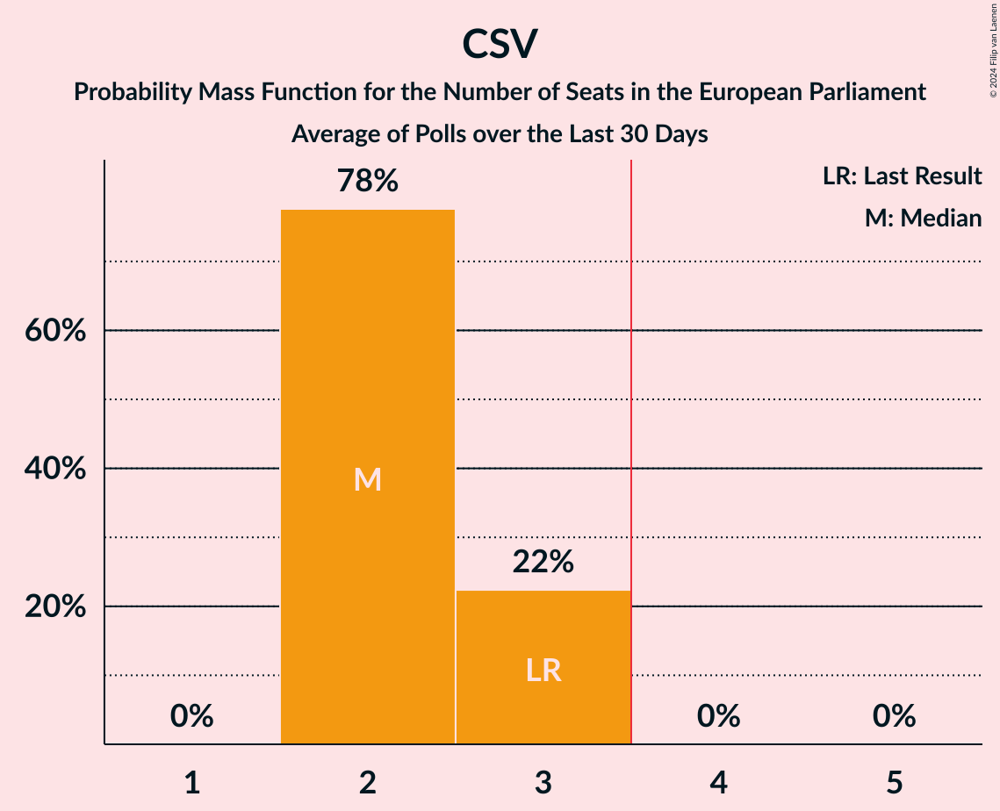

| Number of Seats | Probability | Accumulated | Special Marks |
|:---------------:|:-----------:|:-----------:|:-------------:|
| 2 | 78% | 100% | Median |
| 3 | 22% | 22% | Last Result |
| 4 | 0% | 0% | Majority |

### Demokratesch Partei (RE)

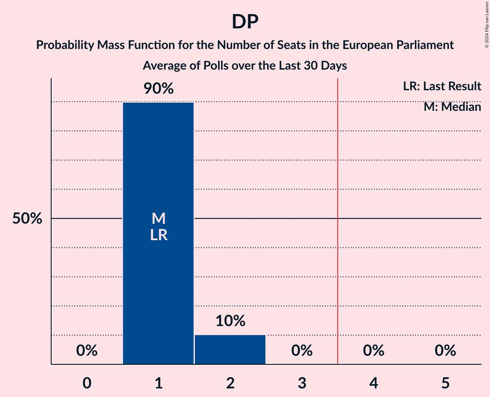

| Number of Seats | Probability | Accumulated | Special Marks |
|:---------------:|:-----------:|:-----------:|:-------------:|
| 1 | 90% | 100% | Last Result, Median |
| 2 | 10% | 10% |  |
| 3 | 0% | 0% |  |

### Lëtzebuerger Sozialistesch Aarbechterpartei (S&D)

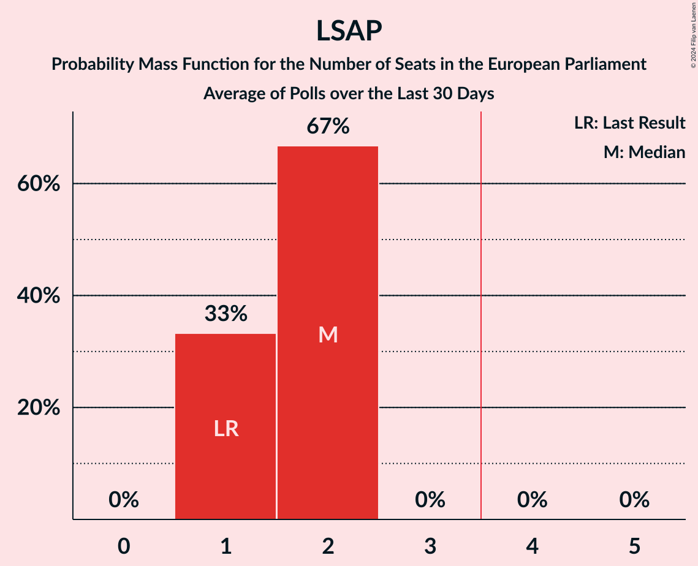

| Number of Seats | Probability | Accumulated | Special Marks |
|:---------------:|:-----------:|:-----------:|:-------------:|
| 1 | 33% | 100% | Last Result |
| 2 | 67% | 67% | Median |
| 3 | 0% | 0% |  |

### déi gréng (Greens/EFA) – Piratepartei Lëtzebuerg (Greens/EFA) – Volt Lëtzebuerg (Greens/EFA)

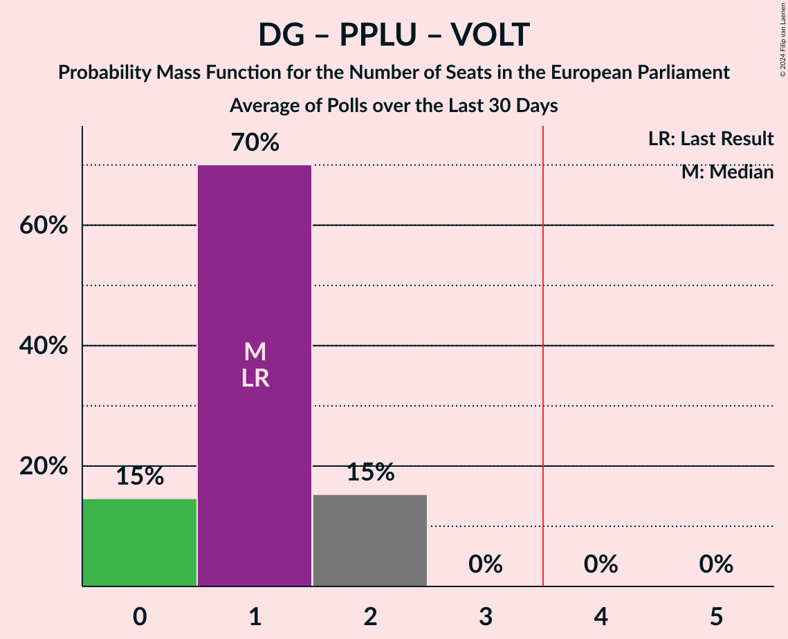

| Number of Seats | Probability | Accumulated | Special Marks |
|:---------------:|:-----------:|:-----------:|:-------------:|
| 0 | 15% | 100% |  |
| 1 | 70% | 85% | Last Result, Median |
| 2 | 15% | 15% |  |
| 3 | 0% | 0% |  |

### Alternativ Demokratesch Reformpartei (ECR)

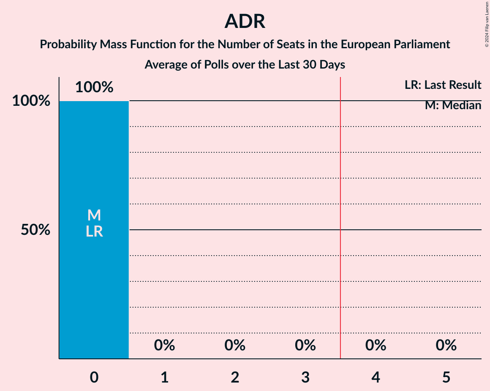

| Number of Seats | Probability | Accumulated | Special Marks |
|:---------------:|:-----------:|:-----------:|:-------------:|
| 0 | 100% | 100% | Last Result, Median |

### Partei fir Integral Demokratie (*) – Kommunistesch Partei Lëtzebuerg (*) – Demokratie (*) – Déi Konservativ (*) – Fokus (*)

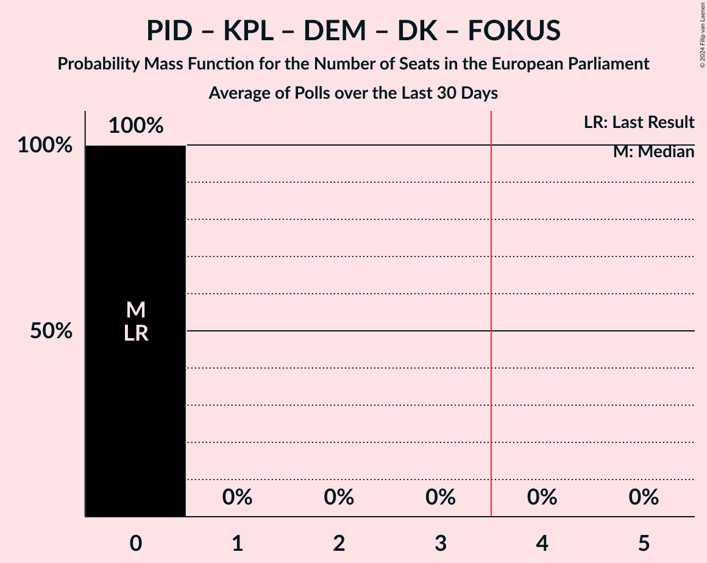

| Number of Seats | Probability | Accumulated | Special Marks |
|:---------------:|:-----------:|:-----------:|:-------------:|
| 0 | 100% | 100% | Last Result, Median |

### déi Lénk (GUE/NGL)

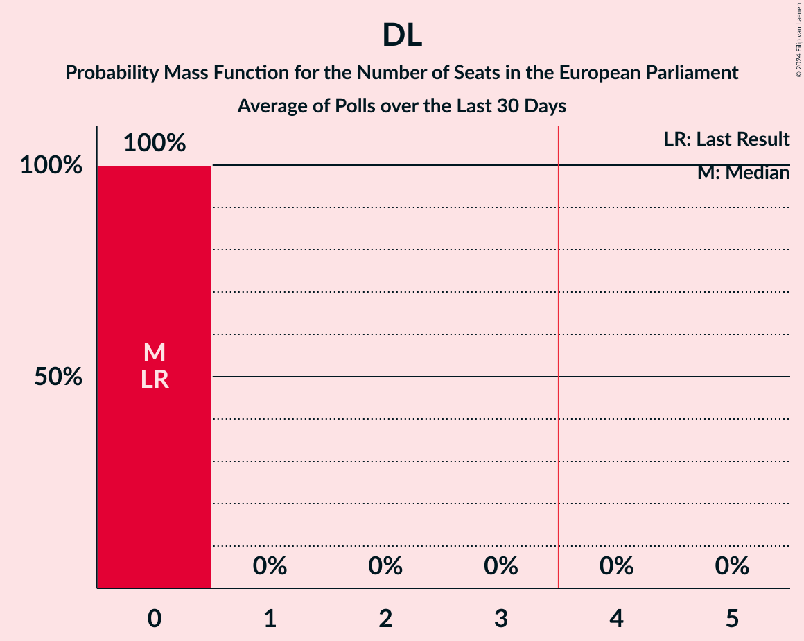

| Number of Seats | Probability | Accumulated | Special Marks |
|:---------------:|:-----------:|:-----------:|:-------------:|
| 0 | 100% | 100% | Last Result, Median |

## Technical Information

+ **Number of polls included in this average:** 1
+ **Lowest number of simulations done in a poll included in this average:** 1,048,576
+ **Total number of simulations done in the polls included in this average:** 1,048,576
+ **Error estimate:** 1.59%
