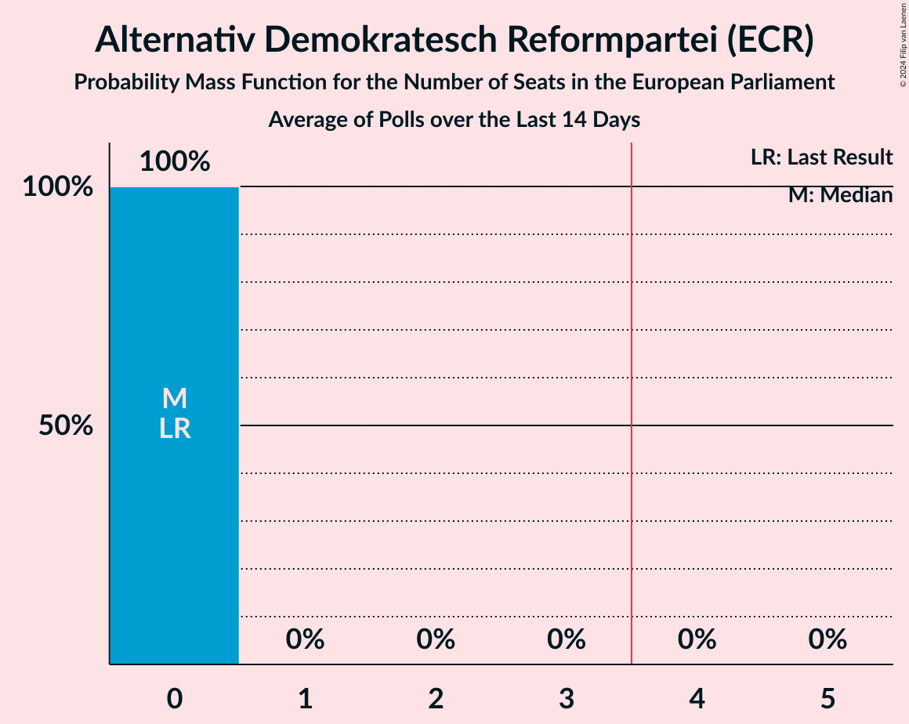

# Alternativ Demokratesch Reformpartei (ECR)

<a href="#voting-intentions">Voting Intentions</a> | <a href="#seats">Seats</a>

## Voting Intentions

Last result: **7.5%** (General Election of 26 May 2019)

### Confidence Intervals

| Period     | Polling firm/Commissioner(s) | Median | 80% Confidence Interval | 90% Confidence Interval | 95% Confidence Interval | 99% Confidence Interval |
|:----------:|:----------------:|:-----------:|:-----------------------:|:-----------------------:|:-----------------------:|:-----------------------:|
| N/A | [Poll Average](average.html) | 6.9% | 6.2–7.7% | 6.0–7.9% | 5.8–8.1% | 5.5–8.5% |
| [7–16 August 2023](2023-08-16-Ilres.html) | Ilres   Luxemburger Wort and RTL | 6.9% | 6.2–7.7% | 6.0–7.9% | 5.8–8.1% | 5.5–8.5% |
| [23 March–6 April 2023](2023-04-06-TNSIlres.html) | TNS Ilres   Luxemburger Wort and RTL | 7.5% | 6.8–8.3% | 6.5–8.6% | 6.4–8.8% | 6.0–9.2% |
| [14–28 November 2022](2022-11-28-TNSIlres.html) | TNS Ilres   Luxemburger Wort and RTL | 7.7% | 7.0–8.6% | 6.8–8.8% | 6.6–9.0% | 6.2–9.5% |
| [24 May–7 June 2022](2022-06-07-TNSIlres.html) | TNS Ilres   Luxemburger Wort and RTL | 7.6% | N/A | N/A | N/A | N/A |
| [10–24 November 2021](2021-11-24-TNSIlres.html) | TNS Ilres   Luxemburger Wort and RTL | 11.3% | N/A | N/A | N/A | N/A |
| [9–21 June 2021](2021-06-21-TNSIlres.html) | TNS Ilres   Luxemburger Wort and RTL | 7.6% | N/A | N/A | N/A | N/A |
| [10–24 November 2020](2020-11-24-TNSIlres.html) | TNS Ilres   Luxemburger Wort and RTL | 9.6% | N/A | N/A | N/A | N/A |
| [8–24 June 2020](2020-06-24-TNSIlres.html) | TNS Ilres   Luxemburger Wort and RTL | 8.2% | N/A | N/A | N/A | N/A |
| [14–23 November 2019](2019-11-23-TNSIlres.html) | TNS Ilres   Luxemburger Wort and RTL | 10.4% | N/A | N/A | N/A | N/A |

### Probability Mass Function

The following table shows the probability mass function per percentage block of voting intentions for the [poll average](average.html) for Alternativ Demokratesch Reformpartei (ECR).

| Voting Intentions | Probability | Accumulated | Special Marks |
|:-----------------:|:-----------:|:-----------:|:-------------:|
| 3.5–4.5% | 0% | 100% |  |
| 4.5–5.5% | 0.6% | 100% |  |
| 5.5–6.5% | 26% | 99.4% |  |
| 6.5–7.5% | 59% | 74% | Median |
| 7.5–8.5% | 14% | 15% | Last Result |
| 8.5–9.5% | 0.4% | 0.4% |  |
| 9.5–10.5% | 0% | 0% |  |

## Seats

Last result: **0** seats (General Election of 26 May 2019)

### Confidence Intervals

| Period     | Polling firm/Commissioner(s) | Median | 80% Confidence Interval | 90% Confidence Interval | 95% Confidence Interval | 99% Confidence Interval |
|:----------:|:----------------:|:------:|:-----------------------:|:-----------------------:|:-----------------------:|:-----------------------:|
| N/A | [Poll Average](average.html) | 0 | 0 | 0 | 0 | 0 |
| [7–16 August 2023](2023-08-16-Ilres.html) | Ilres   Luxemburger Wort and RTL | 0 | 0 | 0 | 0 | 0 |
| [23 March–6 April 2023](2023-04-06-TNSIlres.html) | TNS Ilres   Luxemburger Wort and RTL | 0 | 0 | 0 | 0 | 0 |
| [14–28 November 2022](2022-11-28-TNSIlres.html) | TNS Ilres   Luxemburger Wort and RTL | 0 | 0 | 0 | 0 | 0 |
| [24 May–7 June 2022](2022-06-07-TNSIlres.html) | TNS Ilres   Luxemburger Wort and RTL |  |  |  |  |  |
| [10–24 November 2021](2021-11-24-TNSIlres.html) | TNS Ilres   Luxemburger Wort and RTL |  |  |  |  |  |
| [9–21 June 2021](2021-06-21-TNSIlres.html) | TNS Ilres   Luxemburger Wort and RTL |  |  |  |  |  |
| [10–24 November 2020](2020-11-24-TNSIlres.html) | TNS Ilres   Luxemburger Wort and RTL |  |  |  |  |  |
| [8–24 June 2020](2020-06-24-TNSIlres.html) | TNS Ilres   Luxemburger Wort and RTL |  |  |  |  |  |
| [14–23 November 2019](2019-11-23-TNSIlres.html) | TNS Ilres   Luxemburger Wort and RTL |  |  |  |  |  |

### Probability Mass Function

The following table shows the probability mass function per seat for the [poll average](average.html) for Alternativ Demokratesch Reformpartei (ECR).

| Number of Seats | Probability | Accumulated | Special Marks |
|:---------------:|:-----------:|:-----------:|:-------------:|
| 0 | 100% | 100% | Last Result, Median |

