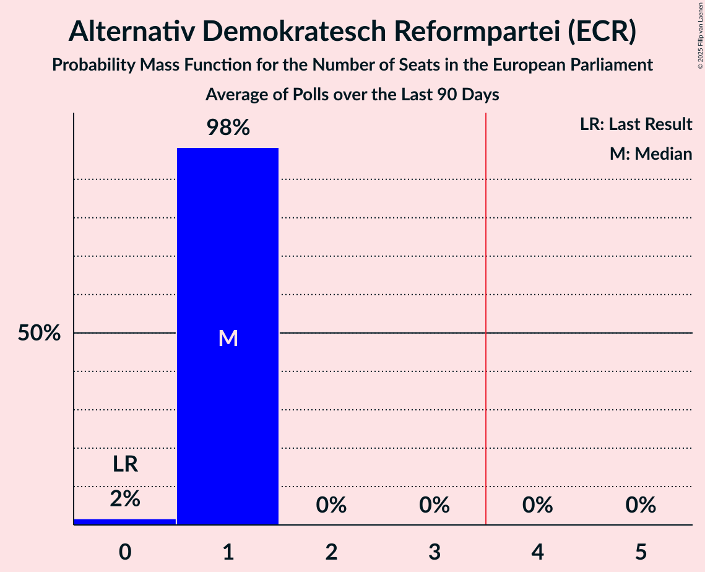

# Alternativ Demokratesch Reformpartei (ECR)

<a href="#voting-intentions">Voting Intentions</a> | <a href="#seats">Seats</a>

## Voting Intentions

Last result: **7.5%** (General Election of 26 May 2019)

### Confidence Intervals

| Period     | Polling firm/Commissioner(s) | Median | 80% Confidence Interval | 90% Confidence Interval | 95% Confidence Interval | 99% Confidence Interval |
|:----------:|:----------------:|:-----------:|:-----------------------:|:-----------------------:|:-----------------------:|:-----------------------:|
| N/A | [Poll Average](average.html) | 8.3% | 7.5–9.1% | 7.2–9.4% | 7.0–9.6% | 6.7–10.0% |
| [8–24 June 2020](2020-06-24-Kantar.html) | Kantar   Luxemburger Wort and RTL | 8.2% | 7.5–9.1% | 7.2–9.4% | 7.0–9.6% | 6.7–10.0% |
| [14–23 November 2019](2019-11-23-Kantar.html) | Kantar   Luxemburger Wort and RTL | 10.4% | 9.5–11.4% | 9.3–11.6% | 9.1–11.9% | 8.7–12.3% |

### Probability Mass Function

The following table shows the probability mass function per percentage block of voting intentions for the [poll average](average.html) for Alternativ Demokratesch Reformpartei (ECR).

| Voting Intentions | Probability | Accumulated | Special Marks |
|:-----------------:|:-----------:|:-----------:|:-------------:|
| 4.5–5.5% | 0% | 100% |  |
| 5.5–6.5% | 0.2% | 100% |  |
| 6.5–7.5% | 13% | 99.8% |  |
| 7.5–8.5% | 54% | 87% | Last Result, Median |
| 8.5–9.5% | 30% | 33% |  |
| 9.5–10.5% | 3% | 3% |  |
| 10.5–11.5% | 0.1% | 0.1% |  |
| 11.5–12.5% | 0% | 0% |  |

## Seats

Last result: **0** seats (General Election of 26 May 2019)

### Confidence Intervals

| Period     | Polling firm/Commissioner(s) | Median | 80% Confidence Interval | 90% Confidence Interval | 95% Confidence Interval | 99% Confidence Interval |
|:----------:|:----------------:|:------:|:-----------------------:|:-----------------------:|:-----------------------:|:-----------------------:|
| N/A | [Poll Average](average.html) | 0 | 0 | 0 | 0 | 0–1 |
| [8–24 June 2020](2020-06-24-Kantar.html) | Kantar   Luxemburger Wort and RTL | 0 | 0 | 0 | 0 | 0–1 |
| [14–23 November 2019](2019-11-23-Kantar.html) | Kantar   Luxemburger Wort and RTL | 1 | 0–1 | 0–1 | 0–1 | 0–1 |

### Probability Mass Function

The following table shows the probability mass function per seat for the [poll average](average.html) for Alternativ Demokratesch Reformpartei (ECR).

| Number of Seats | Probability | Accumulated | Special Marks |
|:---------------:|:-----------:|:-----------:|:-------------:|
| 0 | 99.2% | 100% | Last Result, Median |
| 1 | 0.8% | 0.8% |  |
| 2 | 0% | 0% |  |

