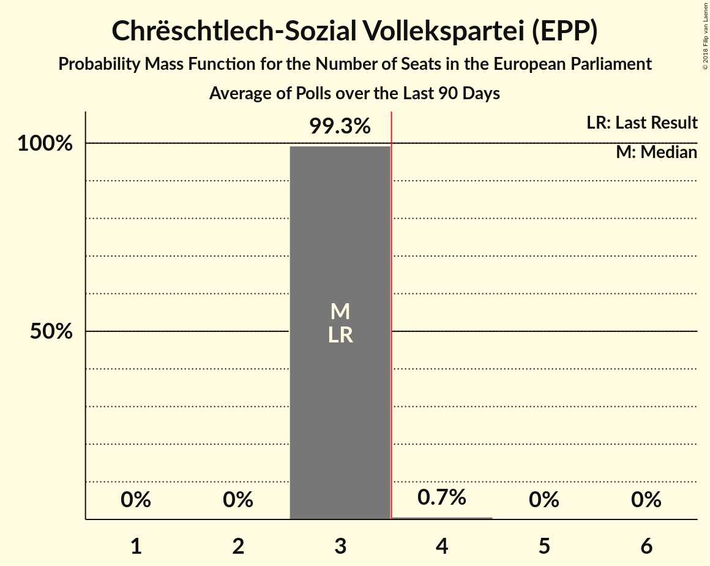

# Chrëschtlech-Sozial Vollekspartei (EPP)

<a href="#voting-intentions">Voting Intentions</a> | <a href="#seats">Seats</a>

## Voting Intentions

Last result: **37.6%** (General Election of 26 May 2019)

### Confidence Intervals

| Period     | Polling firm/Commissioner(s) | Median | 80% Confidence Interval | 90% Confidence Interval | 95% Confidence Interval | 99% Confidence Interval |
|:----------:|:----------------:|:-----------:|:-----------------------:|:-----------------------:|:-----------------------:|:-----------------------:|
| N/A | [Poll Average](average.html) | 23.2% | 22.0–24.5% | 21.6–24.9% | 21.3–25.2% | 20.7–25.9% |
| [14–28 November 2022](2022-11-28-TNSIlres.html) | TNS Ilres   Luxemburger Wort and RTL | 23.4% | 22.1–24.7% | 21.8–25.1% | 21.5–25.4% | 20.9–26.0% |
| [24 May–7 June 2022](2022-06-07-TNSIlresandKantarPublic.html) | TNS Ilres and Kantar Public   Luxemburger Wort and RTL | 23.0% | 21.8–24.3% | 21.5–24.7% | 21.2–25.0% | 20.6–25.6% |
| [10–24 November 2021](2021-11-24-TNSIlresandKantarPublic.html) | TNS Ilres and Kantar Public   Luxemburger Wort and RTL | 21.6% | 20.4–22.9% | 20.1–23.2% | 19.8–23.5% | 19.3–24.1% |
| [9–21 June 2021](2021-06-21-TNSIlresandKantarPublic.html) | TNS Ilres and Kantar Public   Luxemburger Wort and RTL | 24.6% | 23.4–25.9% | 23.0–26.3% | 22.7–26.6% | 22.1–27.3% |
| [10–24 November 2020](2020-11-24-TNSIlresandKantarPublic.html) | TNS Ilres and Kantar Public   Luxemburger Wort and RTL | 25.7% | 24.4–27.0% | 24.1–27.4% | 23.8–27.7% | 23.2–28.4% |
| [8–24 June 2020](2020-06-24-Kantar.html) | Kantar   Luxemburger Wort and RTL | 27.5% | 26.2–28.9% | 25.8–29.3% | 25.5–29.6% | 24.9–30.3% |
| [14–23 November 2019](2019-11-23-Kantar.html) | Kantar   Luxemburger Wort and RTL | 30.1% | 28.8–31.5% | 28.4–31.9% | 28.1–32.3% | 27.4–32.9% |

### Probability Mass Function

The following table shows the probability mass function per percentage block of voting intentions for the [poll average](average.html) for Chrëschtlech-Sozial Vollekspartei (EPP).

| Voting Intentions | Probability | Accumulated | Special Marks |
|:-----------------:|:-----------:|:-----------:|:-------------:|
| 18.5–19.5% | 0% | 100% |  |
| 19.5–20.5% | 0.3% | 100% |  |
| 20.5–21.5% | 4% | 99.7% |  |
| 21.5–22.5% | 21% | 96% |  |
| 22.5–23.5% | 38% | 75% | Median |
| 23.5–24.5% | 28% | 37% |  |
| 24.5–25.5% | 8% | 9% |  |
| 25.5–26.5% | 1.1% | 1.1% |  |
| 26.5–27.5% | 0.1% | 0.1% |  |
| 27.5–28.5% | 0% | 0% |  |
| 28.5–29.5% | 0% | 0% |  |
| 29.5–30.5% | 0% | 0% |  |
| 30.5–31.5% | 0% | 0% |  |
| 31.5–32.5% | 0% | 0% |  |
| 32.5–33.5% | 0% | 0% |  |
| 33.5–34.5% | 0% | 0% |  |
| 34.5–35.5% | 0% | 0% |  |
| 35.5–36.5% | 0% | 0% |  |
| 36.5–37.5% | 0% | 0% |  |
| 37.5–38.5% | 0% | 0% | Last Result |

## Seats

Last result: **3** seats (General Election of 26 May 2019)

### Confidence Intervals

| Period     | Polling firm/Commissioner(s) | Median | 80% Confidence Interval | 90% Confidence Interval | 95% Confidence Interval | 99% Confidence Interval |
|:----------:|:----------------:|:------:|:-----------------------:|:-----------------------:|:-----------------------:|:-----------------------:|
| N/A | [Poll Average](average.html) | 2 | 2 | 2 | 2 | 2 |
| [14–28 November 2022](2022-11-28-TNSIlres.html) | TNS Ilres   Luxemburger Wort and RTL | 2 | 2 | 2 | 2 | 2 |
| [24 May–7 June 2022](2022-06-07-TNSIlresandKantarPublic.html) | TNS Ilres and Kantar Public   Luxemburger Wort and RTL | 2 | 2 | 2 | 2 | 2 |
| [10–24 November 2021](2021-11-24-TNSIlresandKantarPublic.html) | TNS Ilres and Kantar Public   Luxemburger Wort and RTL | 2 | 1–2 | 1–2 | 1–2 | 1–2 |
| [9–21 June 2021](2021-06-21-TNSIlresandKantarPublic.html) | TNS Ilres and Kantar Public   Luxemburger Wort and RTL | 2 | 2 | 2 | 2 | 2–3 |
| [10–24 November 2020](2020-11-24-TNSIlresandKantarPublic.html) | TNS Ilres and Kantar Public   Luxemburger Wort and RTL | 2 | 2 | 2 | 2 | 2 |
| [8–24 June 2020](2020-06-24-Kantar.html) | Kantar   Luxemburger Wort and RTL | 2 | 2 | 2 | 2–3 | 2–3 |
| [14–23 November 2019](2019-11-23-Kantar.html) | Kantar   Luxemburger Wort and RTL | 2 | 2–3 | 2–3 | 2–3 | 2–3 |

### Probability Mass Function

The following table shows the probability mass function per seat for the [poll average](average.html) for Chrëschtlech-Sozial Vollekspartei (EPP).

| Number of Seats | Probability | Accumulated | Special Marks |
|:---------------:|:-----------:|:-----------:|:-------------:|
| 1 | 0.1% | 100% |  |
| 2 | 99.9% | 99.9% | Median |
| 3 | 0% | 0% | Last Result |

