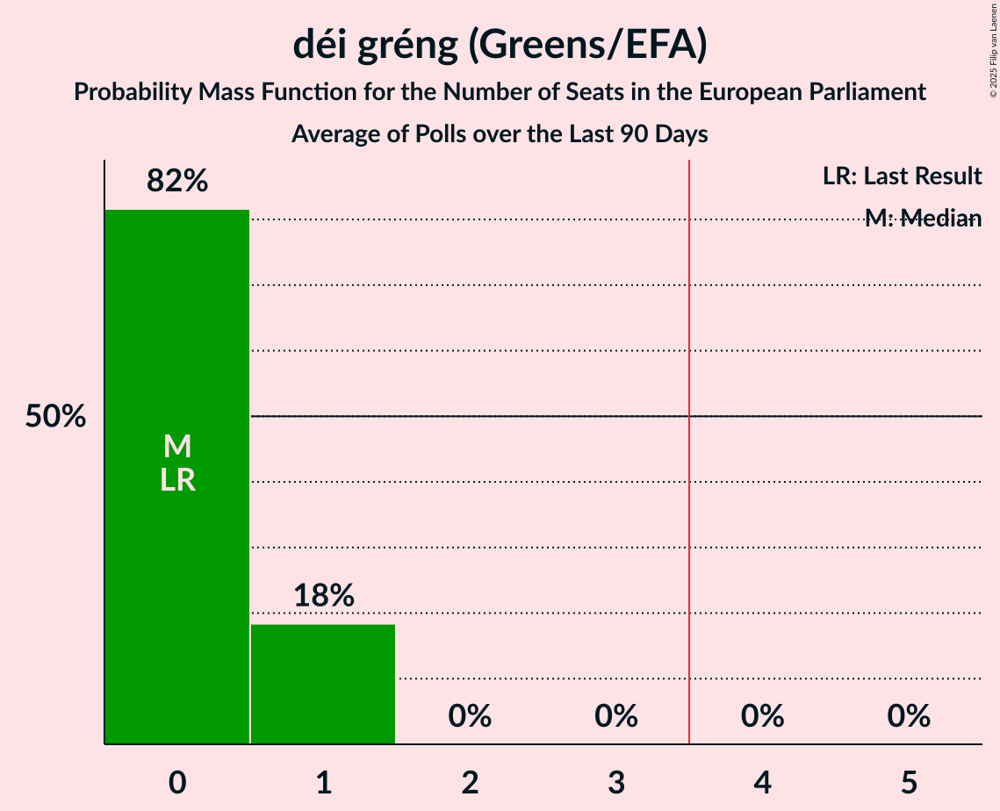

# déi gréng (Greens/EFA)

<a href="#voting-intentions">Voting Intentions</a> | <a href="#seats">Seats</a>

## Voting Intentions

Last result: **0.0%** (General Election of 9 June 2024)

### Confidence Intervals

| Period     | Polling firm/Commissioner(s) | Median | 80% Confidence Interval | 90% Confidence Interval | 95% Confidence Interval | 99% Confidence Interval |
|:----------:|:----------------:|:-----------:|:-----------------------:|:-----------------------:|:-----------------------:|:-----------------------:|
| N/A | [Poll Average](average.html) | 9.4% | 8.5–10.2% | 8.3–10.5% | 8.1–10.7% | 7.7–11.2% |
| [15–29 September 2025](2025-09-29-Ilres.html) | Ilres   Luxemburger Wort and RTL | 9.3% | 8.5–10.2% | 8.3–10.5% | 8.1–10.7% | 7.7–11.2% |
| [8–24 April 2025](2025-04-24-Ilres.html) | Ilres   Luxemburger Wort and RTL | 10.5% | 9.6–11.4% | 9.4–11.7% | 9.2–12.0% | 8.7–12.5% |
| [23–30 September 2024](2024-09-30-Ilres.html) | Ilres   Luxemburger Wort and RTL | 10.1% | 9.3–11.1% | 9.0–11.3% | 8.8–11.6% | 8.4–12.0% |

### Probability Mass Function

The following table shows the probability mass function per percentage block of voting intentions for the [poll average](average.html) for déi gréng (Greens/EFA).

| Voting Intentions | Probability | Accumulated | Special Marks |
|:-----------------:|:-----------:|:-----------:|:-------------:|
| 0.0–0.5% | 0% | 100% | Last Result |
| 0.5–1.5% | 0% | 100% |  |
| 1.5–2.5% | 0% | 100% |  |
| 2.5–3.5% | 0% | 100% |  |
| 3.5–4.5% | 0% | 100% |  |
| 4.5–5.5% | 0% | 100% |  |
| 5.5–6.5% | 0% | 100% |  |
| 6.5–7.5% | 0.2% | 100% |  |
| 7.5–8.5% | 11% | 99.8% |  |
| 8.5–9.5% | 51% | 88% | Median |
| 9.5–10.5% | 33% | 38% |  |
| 10.5–11.5% | 4% | 4% |  |
| 11.5–12.5% | 0.1% | 0.1% |  |
| 12.5–13.5% | 0% | 0% |  |

## Seats

Last result: **0** seats (General Election of 9 June 2024)

### Confidence Intervals

| Period     | Polling firm/Commissioner(s) | Median | 80% Confidence Interval | 90% Confidence Interval | 95% Confidence Interval | 99% Confidence Interval |
|:----------:|:----------------:|:------:|:-----------------------:|:-----------------------:|:-----------------------:|:-----------------------:|
| N/A | [Poll Average](average.html) | 0 | 0–1 | 0–1 | 0–1 | 0–1 |
| [15–29 September 2025](2025-09-29-Ilres.html) | Ilres   Luxemburger Wort and RTL | 0 | 0–1 | 0–1 | 0–1 | 0–1 |
| [8–24 April 2025](2025-04-24-Ilres.html) | Ilres   Luxemburger Wort and RTL | 1 | 0–1 | 0–1 | 0–1 | 0–1 |
| [23–30 September 2024](2024-09-30-Ilres.html) | Ilres   Luxemburger Wort and RTL | 1 | 0–1 | 0–1 | 0–1 | 0–1 |

### Probability Mass Function

The following table shows the probability mass function per seat for the [poll average](average.html) for déi gréng (Greens/EFA).

| Number of Seats | Probability | Accumulated | Special Marks |
|:---------------:|:-----------:|:-----------:|:-------------:|
| 0 | 88% | 100% | Last Result, Median |
| 1 | 12% | 12% |  |
| 2 | 0% | 0% |  |

